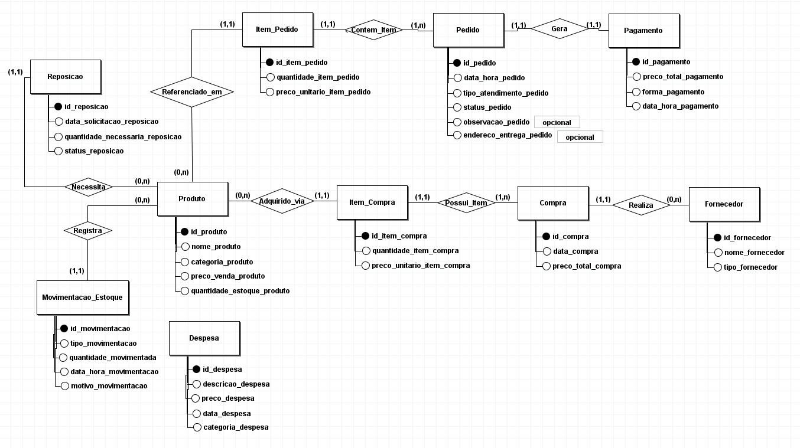

## Metadados

- **Cauã Francisco Gomes da Silva** **- RGM: 47485990**
- **João Pedro Liberato de Oliveira** **- RGM: 46801375**
- **Marcus Vinicius dos Santos Cruz** **- RGM: 46690069**

# Entrega 1 — Modelo Conceitual (DER)
### Modelagem de um sistema de gestão de informações para uma organização de pequeno porte

## 1. Caracterização da Organização

**Nome e natureza da organização**
Bar e Restaurante Esquina dos Amigos é um estabelecimento comercial do ramo de alimentação, com aproximadamente 20 anos de funcionamento. Sua operação envolve a comercialização de refeições, porções, lanches, bebidas alcoólicas e refrigerantes, incluindo pratos especiais disponibilizados em determinados dias da semana.

**Contexto e porte**
O estabelecimento possui uma operação de pequeno porte, contando atualmente com 4 funcionários, incluindo o proprietário. Não existem funções rigidamente atribuídas aos funcionários: todos podem desempenhar as atividades necessárias de acordo com a demanda do estabelecimento, incluindo atendimento, cozinha, reposição, compras e entregas.
A operação é fortemente baseada na experiência adquirida ao longo dos anos e na familiaridade dos funcionários com o próprio comércio e com seus clientes. Dessa forma, diversas atividades são realizadas de maneira informal e sem registros estruturados, baseando-se principalmente no conhecimento dos funcionários e no acompanhamento visual da operação.
O estabelecimento trabalha com diferentes fornecedores. Entre os fornecedores recorrentes estão Ambev, Heineken e Coca-Cola, enquanto outros produtos e ingredientes são adquiridos diretamente em supermercados.

**Problemas e necessidades identificados**
O principal problema identificado está na baixa formalização dos registros operacionais e financeiros.
Atualmente, as principais informações registradas são:
* produtos que precisam ser recebidos dos fornecedores;
* gastos realizados com fornecedores;
* gastos realizados em supermercados;
* contas do estabelecimento.

Não existe um registro estruturado das vendas realizadas durante o dia. O estabelecimento também não mantém registros de mesa, nome do cliente ou número de comanda.
O controle dos produtos comercializados também não é realizado por meio de um sistema estruturado. A quantidade disponível é acompanhada de maneira visual e informal.

Entre as principais necessidades identificadas estão:
* visualizar quanto dinheiro foi movimentado no dia;
* acompanhar de forma mais clara o que entra e o que sai financeiramente;
* possuir maior visibilidade sobre a movimentação geral do estabelecimento;
* controlar a quantidade disponível dos produtos comercializados;
* registrar movimentações de entrada e saída do estoque.

**Justificativa da escolha**
O estabelecimento foi escolhido por apresentar uma operação real, de pequeno porte e com processos suficientemente definidos para a elaboração de um modelo conceitual de banco de dados.
Apesar de a operação funcionar atualmente com base na experiência dos funcionários e em controles manuais, existem diversos dados relacionados a pedidos, produtos, estoque, fornecedores, compras, despesas, pagamentos e entregas que podem ser estruturados em um sistema de gestão.
Esse cenário permite modelar uma solução que não pretende substituir a experiência dos funcionários, mas transformar informações atualmente dispersas ou não registradas em dados estruturados, possibilitando consultas e acompanhamento da operação.

**Evidências da organização**
* Fotos da Visita
  
  
  
  
* Endereço: R. Inês Monteiro, 157 - Artur Alvim, São Paulo - SP, 03568-030
* Telefone: (11) 98109-1622
* Responsável identificado como "Ceará"

---

## 2. Processos de Negócio

**Principais processos mapeados**
A partir do levantamento realizado, foram identificados os seguintes processos principais:
* Atendimento e registro de pedidos
* Preparação e entrega dos pedidos
* Venda e recebimento do pagamento
* Entrega de pedidos nas proximidades
* Controle de produtos em estoque
* Reposição de produtos
* Registro de compras
* Registro de despesas
* Acompanhamento financeiro

**2.1 Atendimento e registro de pedidos**
O cliente realiza o pedido diretamente no estabelecimento ou, no caso de entregas, por meio do WhatsApp.
No atendimento presencial, o funcionário recebe o pedido verbalmente, sem realizar anotações estruturadas. Não são registrados número da mesa, nome do cliente ou número de comanda.
Em seguida, o funcionário comunica verbalmente o pedido à cozinha.
Nos pedidos destinados à entrega, o cliente informa, por meio do WhatsApp, as informações necessárias para que o pedido seja entregue.

**2.2 Preparação e entrega**
A cozinha prepara o pedido com base na comunicação realizada pelo funcionário.
Quando o pedido fica pronto, os funcionários comunicam verbalmente que ele está disponível. Um funcionário pode realizar a entrega do prato ao cliente, porém não existe uma pessoa exclusivamente responsável por essa atividade.
Todos os funcionários podem executar as tarefas necessárias conforme a demanda.

**2.3 Venda e pagamento**
O estabelecimento aceita:
* dinheiro;
* cartão de crédito;
* cartão de débito;
* vale refeição.
* Pix.

Atualmente, as vendas não são registradas individualmente em um sistema.
A solução proposta deverá permitir registrar cada operação comercial e relacioná-la ao respectivo pedido e pagamento.

**2.4 Entregas**
O estabelecimento realiza entregas apenas nas proximidades.
Os pedidos podem ser realizados pelo WhatsApp e a entrega pode ser realizada a pé por qualquer funcionário.
Em determinadas situações, clientes solicitam um Uber para retirada do pedido. Nesse caso, o custo do transporte é pago pelo próprio cliente.
Não existe um funcionário exclusivamente responsável pelas entregas.
Não é cobrado frete para as entregas.

**2.5 Controle de produtos em estoque**
Atualmente, o estabelecimento não realiza um controle estruturado de estoque por sistema.
A quantidade dos produtos comercializados é acompanhada de maneira informal e visual.
A solução proposta deverá permitir registrar a quantidade disponível dos produtos comercializados e suas respectivas movimentações de entrada e saída.
Os ingredientes utilizados na preparação dos alimentos não farão parte do controle de estoque da solução, pois seu controle não constitui uma necessidade identificada durante o levantamento.

**2.6 Compras**
As compras são realizadas pelos próprios funcionários, conforme a necessidade do estabelecimento.
Os produtos comercializados podem ser adquiridos de fornecedores recorrentes, como Ambev, Heineken e Coca-Cola.
Ingredientes utilizados na preparação dos alimentos também podem ser adquiridos diretamente em supermercados.
As compras são registradas manualmente e representam saídas financeiras do estabelecimento.

**2.7 Despesas**
Além das compras, o estabelecimento possui outras contas e despesas, que também são registradas manualmente.
As despesas representam gastos que não correspondem diretamente à aquisição de produtos ou ingredientes.

**2.8 Acompanhamento financeiro**
Atualmente, os registros financeiros são realizados manualmente e posteriormente comparados com os extratos financeiros.
A solução proposta deverá permitir maior visibilidade sobre as entradas e saídas financeiras, possibilitando consultas sobre a movimentação diária e outros períodos.

**Fluxogramas**
* 

---

## 3. Requisitos do Sistema

### 3.1 Requisitos Funcionais
* **RF01 — Cadastrar produtos:** O sistema deve permitir o cadastro dos produtos comercializados pelo estabelecimento, incluindo refeições, porções, lanches, pratos especiais e bebidas.
* **RF02 — Registrar pedidos:** O sistema deve permitir registrar os pedidos realizados pelos clientes.
* **RF03 — Registrar os itens de um pedido:** O sistema deve permitir associar um ou mais produtos a cada pedido.
* **RF04 — Registrar a forma de pagamento:** O sistema deve permitir registrar a forma de pagamento utilizada em uma operação, considerando dinheiro, crédito, débito, vale refeição e Pix.
* **RF05 — Registrar vendas:** O sistema deve permitir registrar as vendas realizadas, possibilitando posteriormente consultar a movimentação financeira.
* **RF06 — Consultar movimentação diária:** O sistema deve permitir consultar o valor movimentado em determinado dia.
* **RF07 — Registrar compras:** O sistema deve permitir registrar compras de produtos comercializados.
* **RF08 — Registrar fornecedores:** O sistema deve permitir cadastrar e identificar fornecedores de produtos.
* **RF09 — Registrar necessidades de reposição:** O sistema deve permitir registrar quais produtos precisam ser repostos, incluindo a quantidade necessária.
* **RF10 — Registrar recebimento de produtos:** O sistema deve permitir registrar o recebimento dos produtos adquiridos.
* **RF11 — Registrar movimentações de estoque:** O sistema deve permitir registrar entradas e saídas dos produtos controlados em estoque.
* **RF12 — Consultar informações de estoque:** O sistema deve permitir visualizar a situação registrada dos produtos em estoque.
* **RF13 — Registrar pedidos para entrega:** O sistema deve permitir identificar pedidos destinados à entrega e registrar as informações necessárias para sua realização.
* **RF14 — Registrar despesas:** O sistema deve permitir registrar despesas do estabelecimento que não correspondam diretamente às compras de produtos ou ingredientes.
* **RF15 — Consultar entradas e saídas financeiras:** O sistema deve permitir consultar os valores registrados como entradas e saídas financeiras.

### 3.2 Requisitos Não Funcionais
Os seguintes requisitos são propostos para a solução, não constituindo características atualmente observadas na organização:
* **RNF01 — Usabilidade:** O sistema deve possuir uma interface simples, considerando que a operação atual é realizada de maneira informal e sem um sistema de gestão estruturado.
* **RNF02 — Disponibilidade:** O sistema deve estar disponível durante o período de funcionamento do estabelecimento para permitir o registro das operações.
* **RNF03 — Integridade dos dados:** Os registros devem manter consistência entre pedidos, produtos, pagamentos, compras, estoque e movimentações financeiras.
* **RNF04 — Segurança:** O acesso aos dados administrativos e financeiros deve ser restrito a usuários autorizados.
* **RNF05 — Desempenho:** O sistema deve responder às operações de cadastro, consulta e registro das operações cotidianas em até 3 segundos em condições normais de uso.
* **RNF06 — Manutenibilidade:** O sistema deve ser estruturado de forma organizada, permitindo a manutenção e evolução de suas funcionalidades sem comprometer os dados já registrados.

---

## 4. Regras de Negócio

**Regras operacionais**
* **RN01 — Formas de pagamento:** As vendas podem ser pagas em dinheiro, cartão de crédito, cartão de débito, vale refeição ou Pix.
* **RN02 — Funcionários:** Não existem funções rigidamente separadas entre os quatro funcionários, incluindo o proprietário. Todos podem executar as atividades necessárias de acordo com a demanda.
* **RN03 — Entrega:** As entregas realizadas pelo estabelecimento são limitadas às proximidades do restaurante.
* **RN04 — Entrega a pé:** Qualquer funcionário pode realizar uma entrega a pé.
* **RN05 — Transporte por aplicativo:** Quando um cliente solicita Uber para retirar ou receber um pedido, o custo do transporte é pago pelo próprio cliente.
* **RN06 — Fornecedores:** Ambev, Heineken e Coca-Cola estão entre os fornecedores recorrentes do estabelecimento. Outros produtos e ingredientes podem ser adquiridos diretamente em supermercados.
* **RN07 — Reposição:** A necessidade de reposição de produtos comercializados é identificada conforme a quantidade disponível e deverá poder ser registrada no sistema, incluindo o produto e a quantidade necessária.
* **RN08 — Conferência de recebimento:** Os produtos recebidos dos fornecedores são comparados com a nota do fornecedor.
* **RN09 — Ausência de comanda:** Atualmente, os pedidos não possuem identificação por mesa, nome do cliente ou número de comanda.
* **RN10 — Controle de estoque:** O controle estruturado de estoque proposto é destinado aos produtos comercializados pelo estabelecimento. Os ingredientes utilizados na preparação dos alimentos não fazem parte do controle de estoque da solução.
* **RN11 — Funcionários:** O sistema não precisa identificar qual funcionário realizou determinada operação, pois todos os funcionários podem desempenhar diferentes atividades do estabelecimento.

**Restrições organizacionais**
A principal restrição identificada é a forte dependência da operação em relação à experiência dos funcionários. Como o estabelecimento funciona há aproximadamente 20 anos, muitos procedimentos são executados com base na familiaridade com o comércio e seus clientes.
Outra restrição é o pequeno porte do estabelecimento e a ausência de registros estruturados de vendas e estoque. A solução deve, portanto, priorizar simplicidade e facilidade de uso, evitando controles que não sejam necessários à realidade observada.

---

## 5. Dicionário de Dados Conceitual

### 5.1 Produto
| Atributo | Descrição | Regra de negócio associada |
|----------|-----------|------------------------------|
| id_produto | Identificador único do produto | Deve identificar exclusivamente cada produto |
| nome_produto | Nome do produto | Obrigatório |
| categoria_produto | Categoria do produto | Deve permitir classificar o produto |
| preco_venda_produto | Preço praticado na venda do produto | Deve representar o preço atual |
| quantidade_estoque_produto | Quantidade atualmente disponível em estoque | Deve representar o saldo atualizado do produto |

### 5.2 Pedido
| Atributo | Descrição | Regra de negócio associada |
|----------|-----------|------------------------------|
| id_pedido | Identificador único do pedido | Deve identificar exclusivamente cada pedido |
| data_hora_pedido | Data e horário em que o pedido foi feito | Obrigatório |
| tipo_atendimento_pedido | Identifica atendimento presencial ou entrega | Deve permitir diferenciar os tipos de atendimento |
| status_pedido | Situação atual do pedido | Deve representar o andamento do pedido |
| observacao_pedido | Informações adicionais do pedido | Opcional |
| endereco_entrega_pedido | Local informado para pedidos de entrega | Obrigatório quando o pedido for destinado à entrega |

### 5.3 Item_Pedido
| Atributo | Descrição | Regra de negócio associada |
|----------|-----------|------------------------------|
| id_item_pedido | Identificador único do item no pedido | Deve identificar o registro do item |
| quantidade_item_pedido | Quantidade do produto solicitada | Deve ser positiva |
| preco_unitario_item_pedido | Preço do produto no momento do pedido | Permite preservar o preço praticado na venda |

### 5.4 Pagamento
| Atributo | Descrição | Regra de negócio associada |
|----------|-----------|------------------------------|
| id_pagamento | Identificador único do pagamento | Deve identificar exclusivamente o pagamento |
| preco_total_pagamento | Preço/montante pago | Deve corresponder ao montante da operação |
| forma_pagamento | Forma utilizada no pagamento | Dinheiro, crédito, débito, vale refeição ou Pix |
| data_hora_pagamento | Momento em que o pagamento foi realizado | Obrigatório |

### 5.5 Fornecedor
| Atributo | Descrição | Regra de negócio associada |
|----------|-----------|------------------------------|
| id_fornecedor | Identificador único do fornecedor | Deve identificar exclusivamente o fornecedor |
| nome_fornecedor | Nome do fornecedor | Obrigatório |
| tipo_fornecedor | Classificação do fornecedor | Pode distinguir fornecedor recorrente de supermercado |

### 5.6 Compra
| Atributo | Descrição | Regra de negócio associada |
|----------|-----------|------------------------------|
| id_compra | Identificador único da compra | Deve identificar exclusivamente a compra |
| data_compra | Data de realização da compra | Obrigatório |
| preco_total_compra | Preço total da compra | Deve corresponder à soma dos itens adquiridos |
| id_fornecedor_compra | Fornecedor relacionado à compra | Deve permitir identificar a origem da compra |

### 5.7 Item_Compra
| Atributo | Descrição | Regra de negócio associada |
|----------|-----------|------------------------------|
| id_item_compra | Identificador único do item comprado | Deve identificar o registro |
| quantidade_item_compra | Quantidade adquirida do produto/ingrediente | Deve ser positiva |
| preco_unitario_item_compra | Preço unitário de aquisição | Deve ser compatível com a compra registrada |

### 5.8 Despesa
| Atributo | Descrição | Regra de negócio associada |
|----------|-----------|------------------------------|
| id_despesa | Identificador único da despesa | Deve identificar exclusivamente a despesa |
| descricao_despesa | Descrição clara da despesa | Obrigatório |
| preco_despesa | Preço/montante da despesa | Deve ser positivo |
| data_despesa | Data associada à despesa | Obrigatório |
| categoria_despesa | Classificação da despesa | Deve permitir distinguir diferentes tipos de gastos |

### 5.9 Reposição
| Atributo | Descrição | Regra de negócio associada |
|----------|-----------|------------------------------|
| id_reposicao | Identificador único da reposição | Deve identificar o registro de reposição |
| data_solicitacao_reposicao| Data da solicitação de reposição | Obrigatório |
| quantidade_necessaria_reposicao| Quantidade necessária para repor o estoque | Deve ser positiva |
| status_reposicao | Situação da solicitação de reposição | Deve permitir identificar se está pendente ou concluída |

### 5.10 Movimentacao_Estoque
| Atributo | Descrição | Regra de negócio associada |
|----------|-----------|------------------------------|
| id_movimentacao | Identificador único da movimentação | Deve identificar exclusivamente o registro |
| tipo_movimentacao | Tipo de movimentação (Entrada ou Saída) | Deve especificar se o estoque aumentou ou diminuiu |
| quantidade_movimentada | Quantidade de itens movimentados | Deve ser positiva |
| data_hora_movimentacao | Data e horário da movimentação | Obrigatório |
| motivo_movimentacao | Motivo da entrada ou saída | Ex: Compra, Venda, Perda, Ajuste |

---

## 6. Modelagem Conceitual (Entidades, Atributos, Relacionamentos)

**Entidades reconhecidas**
A partir dos processos levantados e das validações realizadas, foram identificadas inicialmente as seguintes entidades:
* **Produto:** representa os produtos comercializados pelo estabelecimento e controlados em estoque.
* **Pedido:** representa uma solicitação de produtos realizada por um cliente.
* **Item_Pedido:** representa os produtos que compõem cada pedido.
* **Pagamento:** representa o recebimento associado a um pedido.
* **Fornecedor:** representa empresas ou estabelecimentos responsáveis pelo fornecimento de produtos.
* **Compra:** representa uma aquisição realizada pelo estabelecimento.
* **Item_Compra:** representa os itens que compõem uma compra.
* **Despesa:** representa gastos do estabelecimento que não correspondem diretamente às compras.
* **Reposição:** representa uma necessidade registrada de reposição de produtos em estoque.
* **Movimentacao_Estoque:** representa os registros de entrada e saída dos produtos no estoque, permitindo o acompanhamento detalhado de suas quantidades e motivos.

*Nota:* A entidade **Funcionário** não será incluída no modelo, pois a identificação do responsável por cada operação não constitui uma necessidade do sistema. Todos os quatro funcionários, incluindo o proprietário, podem desempenhar diferentes atividades conforme a demanda.
A entidade **Cliente** não será incluída como cadastro independente, pois o estabelecimento não mantém atualmente um cadastro estruturado de clientes. Para pedidos destinados à entrega, as informações necessárias para realização da entrega serão associadas ao próprio pedido.
Também não será criada uma entidade **Venda** separada, pois o pedido representa a operação comercial que será registrada e relacionada ao respectivo pagamento.

**Atributos e classificações**
Cada entidade possui atributos destinados a representar as informações necessárias para identificar, descrever e relacionar os elementos da operação.
A entidade Produto concentra informações sobre os itens comercializados e seu saldo de estoque, enquanto Pedido representa a ocorrência da venda e Item_Pedido permite representar os diferentes produtos existentes dentro de um mesmo pedido.
A separação entre Compra e Item_Compra permite representar uma compra contendo diversos itens sem armazenar múltiplos produtos dentro de um único atributo. A entidade Movimentacao_Estoque atua garantindo o rastreamento preciso da disponibilidade dos produtos.

**Relacionamentos pertinentes**
A modelagem proposta considera inicialmente os seguintes relacionamentos:
* Um Pedido possui um ou mais Itens_Pedido.
* Cada Item_Pedido pertence a um único Pedido.
* Um Produto pode aparecer em diversos Itens_Pedido.
* Cada Item_Pedido referencia um único Produto.
* Um Pedido está associado a um Pagamento.
* Um Fornecedor pode estar relacionado a diversas Compras.
* Cada Compra está relacionada a um único Fornecedor.
* Uma Compra possui um ou mais Itens_Compra.
* Cada Item_Compra pertence a uma única Compra.
* Um Produto pode aparecer em diversas Compras, por meio de Item_Compra.
* Cada Item_Compra referencia um único Produto.
* Um Produto pode possuir diversos registros de Reposição.
* Cada Reposição está relacionada a um único Produto.
* Um Produto pode possuir diversas Movimentações_Estoque.
* Cada Movimentacao_Estoque está relacionada a um único Produto.
* As Despesas são registradas independentemente dos pedidos e compras.

**Restrições e políticas organizacionais aplicadas ao modelo**
O modelo deve considerar que:
* existem diferentes formas de pagamento;
* qualquer funcionário pode participar da operação, sem necessidade de identificação individual no sistema;
* as vendas podem ocorrer presencialmente ou por entrega;
* produtos e ingredientes podem ser adquiridos de fornecedores ou de supermercados;
* somente os produtos comercializados serão controlados no estoque estruturado da solução;
* compras e despesas representam saídas financeiras;
* pedidos de entrega possuem informações de localização fornecidas pelo cliente;
* não existe uma pessoa exclusivamente responsável pelas entregas.

---

## 7. Diagrama Entidade-Relacionamento (DER)

O DER deverá representar:
* entidades;
* atributos;
* relacionamentos;
* cardinalidades;
* identificação das entidades;
* relações entre pedidos, produtos e pagamentos;
* relações entre compras, fornecedores e produtos;
* estrutura necessária para representar despesas e reposições;
* estrutura necessária para representar as movimentações de estoque.

O modelo deverá ser construído de maneira que possa posteriormente ser convertido para um modelo lógico relacional e implementado em SQL.

---

## 8. Justificativa Técnica

A modelagem proposta busca transformar os principais processos atualmente executados de maneira manual e informal em estruturas de dados organizadas.
A entidade **Produto** é necessária porque os produtos comercializados representam elementos centrais das vendas e do controle de estoque.
A separação entre **Pedido** e **Item_Pedido** permite que um pedido contenha diversos produtos sem criar atributos repetitivos dentro da entidade Pedido. Além disso, permite registrar a quantidade e o preço praticado de cada item.
A entidade **Pagamento** foi separada do pedido para representar explicitamente a forma pela qual uma operação comercial foi recebida, contemplando dinheiro, cartão de crédito, cartão de débito e Pix.
Não foi criada uma entidade **Venda** separada porque não existe uma necessidade identificada de distinguir uma venda de seu pedido. O pedido representa a operação comercial e pode ser associado ao pagamento correspondente.
A separação entre **Compra** e **Item_Compra** permite representar uma única compra contendo diversos itens.
A entidade **Fornecedor** permite registrar a origem das compras e representar fornecedores recorrentes, como Ambev, Heineken e Coca-Cola, além de outros estabelecimentos utilizados para aquisição de produtos e ingredientes.
A entidade **Despesa** representa gastos do estabelecimento que não correspondem diretamente à aquisição de produtos ou ingredientes. Essa separação permite distinguir compras de outras obrigações financeiras e atende à necessidade de compreender o que entra e o que sai financeiramente.
A entidade **Reposição** representa a necessidade de reposição de produtos comercializados, permitindo registrar o produto, a quantidade necessária e a situação da reposição.
O controle de estoque foi incluído como uma necessidade da solução proposta para os produtos comercializados, embora atualmente seja realizado de maneira informal. A entidade **Movimentacao_Estoque** permite rastrear cada entrada e saída individual, garantindo que o saldo seja sempre justificável com base em motivos reais (vendas, compras, quebras, etc).
A entidade **Funcionário** não foi incluída porque a organização não necessita identificar qual funcionário executou determinada operação. Todos os funcionários podem desempenhar diferentes tarefas.
A entidade **Cliente** não foi incluída como cadastro independente porque não existe uma necessidade identificada de manter um cadastro permanente de clientes. Para pedidos destinados à entrega, as informações necessárias podem ser associadas diretamente ao pedido.
A estrutura proposta busca solucionar uma das principais dores identificadas: a dificuldade de visualizar de maneira simples quanto foi movimentado em determinado dia. Com pedidos e pagamentos estruturados, juntamente com compras e despesas registradas, torna-se possível realizar consultas sobre a movimentação financeira.

---

## 9. Uso de Inteligência Artificial

O grupo utilizou ChatGPT como ferramenta de apoio durante a elaboração do trabalho.

**Organização e interpretação das informações**

| Item | Registro |
|------|-----------|
| **Ferramenta e etapa** | ChatGPT — organização das informações levantadas durante a entrevista e estruturação da Entrega 1 |
| **Motivação** | Organizar as informações coletadas, identificar processos, requisitos, regras de negócio e possíveis entidades para o modelo conceitual de forma prática |
| **Prompt(s) utilizados** | 1. “Com base nas informações levantadas sobre a organização, organize os principais processos de negócio, requisitos funcionais, regras de negócio e entidades que poderiam fazer parte de um modelo conceitual de banco de dados.” 2. “Analise a documentação e o DER e verifique se as entidades, atributos, relacionamentos e cardinalidades estão coerentes com os requisitos e regras de negócio levantados.” 3. “Revise os relacionamentos pertinentes do modelo e identifique se existe algum relacionamento faltando ou alguma cardinalidade que precise ser ajustada.” |
| **Resposta recebida** | A IA organizou as informações da entrevista em processos de negócio, requisitos funcionais, requisitos não funcionais e regras de negócio, além de sugerir entidades e relacionamentos candidatos para o modelo conceitual. Posteriormente, auxiliou na revisão crítica do modelo, identificando inconsistências entre a documentação e o DER, como a necessidade de representar as movimentações de estoque e ajustes nas cardinalidades e atributos. |
| **Fontes consultadas e verificadas** | As informações referentes à operação foram obtidas a partir da entrevista/pesquisa de campo realizada pelo grupo. Os conteúdos teóricos das aulas também foram utilizados como material de apoio |
| **Trechos rejeitados ou corrigidos** | Sugestões de entidades ou processos que não correspondessem à realidade observada foram rejeitadas ou ajustadas pelo grupo após a validação com o responsável |
| **Justificativa da escolha final** | A decisão final sobre processos, entidades, atributos e regras foi tomada pelo grupo com base na realidade observada na organização e nas informações validadas durante a entrevista |
| **Reflexão crítica** | A IA pode propor estruturas de dados plausíveis que não necessariamente correspondem ao funcionamento real do estabelecimento. Por isso, suas sugestões foram utilizadas como apoio à modelagem e confrontadas com as informações obtidas em campo. |

---

## Critérios Atitudinais
Os critérios atitudinais são avaliados por meio da participação, comprometimento, colaboração e autonomia dos integrantes do grupo, incluindo o histórico de commits no GitHub.
