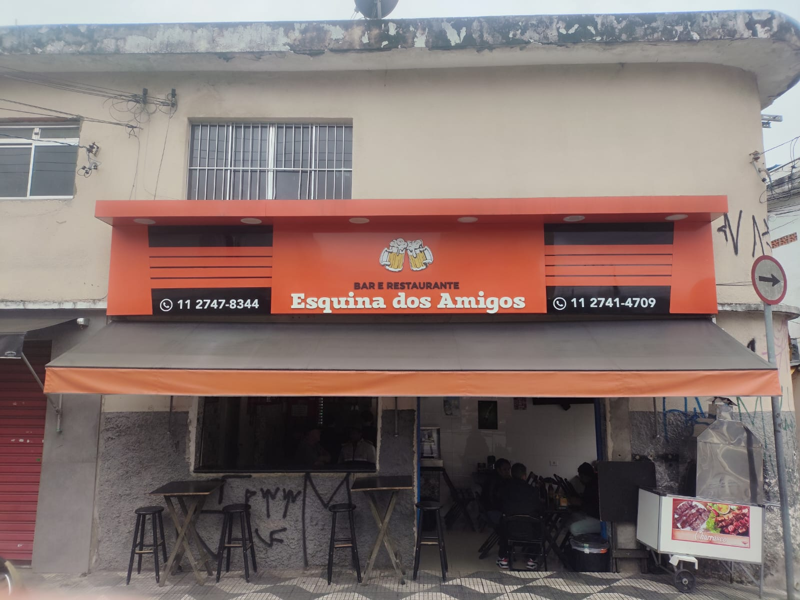
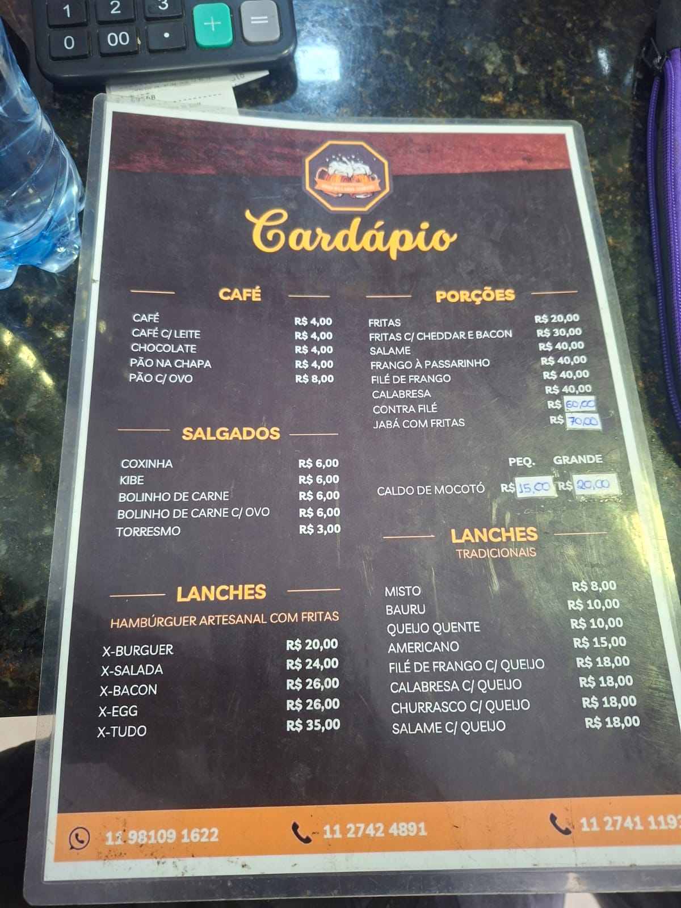
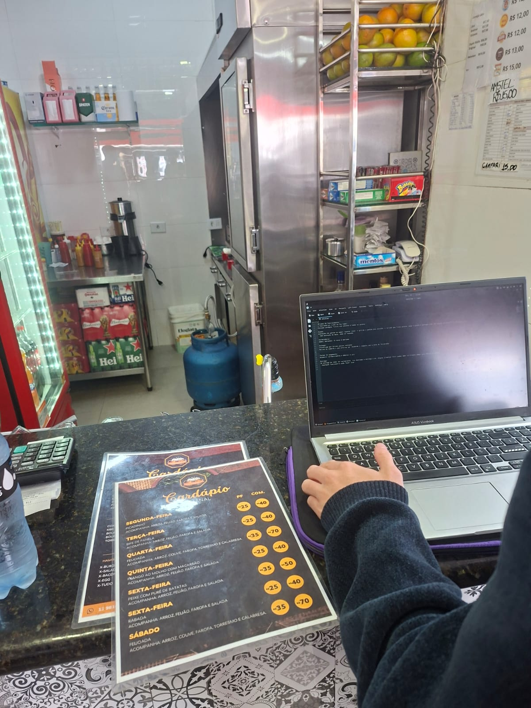
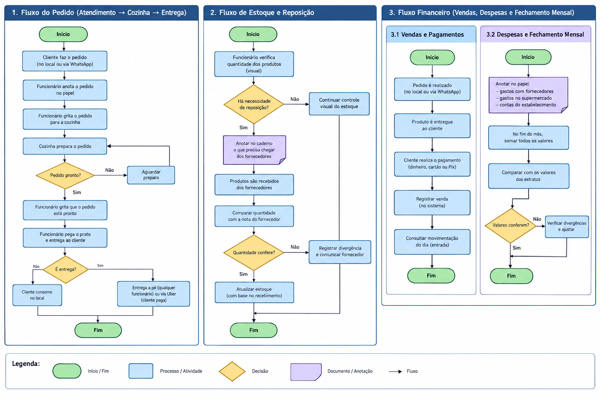
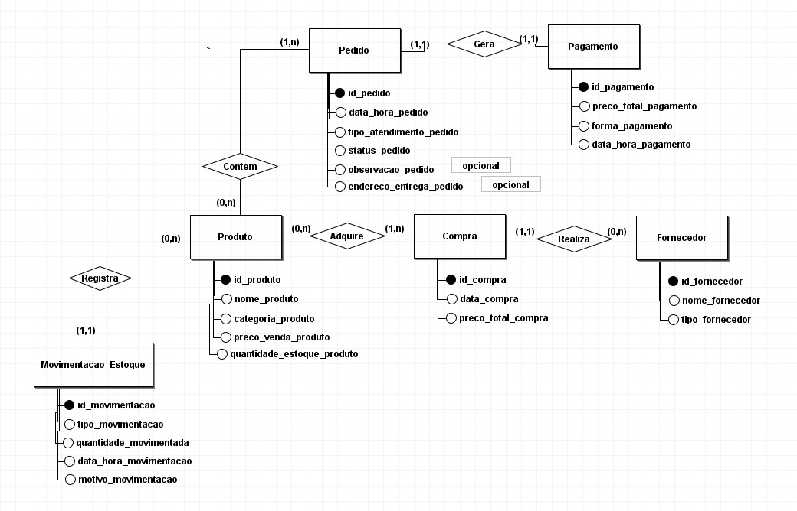

# Entrega 2 — Modelo Lógico, Implementação SQL e Apresentação Final

### Modelagem de um sistema de gestão de informações para uma organização de pequeno porte

**Organização estudada:** Bar e Restaurante Esquina dos Amigos, São Paulo/SP.

> **Critério de entrega:** este `README.md` da raiz da branch `main` é o Relatório Técnico Final. Os demais artefatos devem permanecer em arquivos próprios, referenciados neste relatório. As seções ainda não concluídas são identificadas como pendentes; nenhuma informação de campo, decisão de modelagem ou implementação SQL é presumida.

## 1. Relatório Técnico Final

### Integrantes

| Nome completo | RGM | Usuário do GitHub |
|---|---|---|
| Cauã Francisco Gomes da Silva | 47485990 | A confirmar pelo integrante |
| João Pedro Liberato de Oliveira | 46801375 | A confirmar pelo integrante |
| Marcus Vinicius dos Santos Cruz | 46690069 | A confirmar pelo integrante |
| João Vitor Gonçalves De Oliveira | 47391111 | A confirmar pelo integrante |

### 1.1 Revisão do Modelo Conceitual

Esta seção reúne a revisão documental da Entrega 1: caracterização da organização, relato do levantamento, processos, RF/RNF, RN01–RN20, inventário de dados, relacionamentos, DER existente e justificativas conceituais.

**Documentos de apoio:** [levantamento organizado](levantamento/levantamento.md), [evidências e pendências](levantamento/evidencias.md), [perguntas e respostas originais](levantamento/fontes/perguntas-e-respostas.txt), [confirmações documentais](levantamento/fontes/confirmacoes-documentais.md) e [dicionário de dados em HTML](dicionario_dados_conceitual.html).

**Situação:** as informações disponíveis foram consolidadas na Entrega 1. Permanecem pendentes de validação presencial os volumes de operação, os metadados e a comprovação fotográfica específica da entrevista, além de decisões técnicas do DER indicadas adiante. A revisão textual não deve ser confundida com a aprovação do modelo pelo professor.

#### Caracterização da Organização

**Nome e natureza da organização**
Bar e Restaurante Esquina dos Amigos é um estabelecimento comercial do ramo de alimentação, com aproximadamente 20 anos de funcionamento. Sua operação envolve a comercialização de refeições, porções, lanches, bebidas alcoólicas e refrigerantes, incluindo pratos especiais disponibilizados em determinados dias da semana.

**Contexto e porte**
O estabelecimento possui uma operação de pequeno porte. O README da Entrega 1 registra 4 pessoas incluindo o proprietário, enquanto as anotações originais informam 3 funcionários. A composição exata da equipe permanece pendente de confirmação; não se presume que os dois números sejam equivalentes. Não existem funções rigidamente atribuídas aos funcionários: todos podem desempenhar as atividades necessárias de acordo com a demanda do estabelecimento, incluindo atendimento, cozinha, reposição, compras e entregas.
A operação é fortemente baseada na experiência adquirida ao longo dos anos e na familiaridade dos funcionários com o próprio comércio e com seus clientes. Dessa forma, diversas atividades são realizadas de maneira informal e sem registros estruturados, baseando-se principalmente no conhecimento dos funcionários e no acompanhamento visual da operação.
O estabelecimento trabalha com diferentes fornecedores. Entre os fornecedores recorrentes estão Ambev, Heineken e Coca-Cola, enquanto outros produtos e ingredientes são adquiridos diretamente em supermercados.

**Problemas e necessidades identificados**
O principal problema identificado está na baixa formalização dos registros operacionais e financeiros.
Atualmente, as principais informações registradas são:
* produtos que precisam ser recebidos dos fornecedores;
* gastos realizados com fornecedores;
* gastos realizados em supermercados;
* contas do estabelecimento.

Não existe um registro estruturado das vendas realizadas durante o dia. O estabelecimento também não mantém registros de mesa, nome do cliente ou número de comanda.
O controle dos produtos comercializados também não é realizado por meio de um sistema estruturado. A quantidade disponível é acompanhada de maneira visual e informal.

Os problemas passam a ser identificados para rastreabilidade documental:

| Código | Problema identificado | Requisitos relacionados | Limite atual |
|---|---|---|---|
| P1 | Ausência de registro individual das vendas e de visão dos recebimentos do dia | RF02–RF06 | Quantidade e preço por item dependem da revisão do modelo |
| P2 | Entradas e saídas financeiras dispersas entre papel e extratos | RF07, RF14 | Contas do estabelecimento e data de pagamento das compras não estão plenamente representadas |
| P3 | Estoque e necessidade de reposição acompanhados visualmente | RF09–RF12 | Saldo inicial, unidades, ajustes e alcance do controle precisam ser confirmados |

Esses códigos ainda precisam ser vinculados às tabelas finais e consultas Gxx pela equipe responsável pelo modelo lógico e SQL. Não há consultas implementadas nesta revisão.

Entre as principais necessidades identificadas estão:
* visualizar quanto dinheiro foi movimentado no dia;
* acompanhar de forma mais clara o que entra e o que sai financeiramente;
* possuir maior visibilidade sobre a movimentação geral do estabelecimento;
* controlar a quantidade disponível dos produtos comercializados;
* registrar movimentações de entrada e saída do estoque.

**Volumes operacionais**
As fontes disponíveis informam aproximadamente 20 anos de funcionamento, mas não quantificam pedidos por dia/semana, entregas, produtos ativos ou compras por período. Esses volumes devem ser levantados com o responsável antes de justificar a massa fictícia da Entrega 2. A composição da equipe também precisa ser esclarecida.

**Justificativa da escolha**
O estabelecimento foi escolhido por apresentar uma operação real, de pequeno porte e com processos suficientemente definidos para a elaboração de um modelo conceitual de banco de dados.
Apesar de a operação funcionar atualmente com base na experiência dos funcionários e em controles manuais, existem diversos dados relacionados a pedidos, produtos, estoque, fornecedores, compras, pagamentos e entregas que podem ser estruturados em um sistema de gestão.
Esse cenário permite modelar uma solução que não pretende substituir a experiência dos funcionários, mas transformar informações atualmente dispersas ou não registradas em dados estruturados, possibilitando consultas e acompanhamento da operação.

**Evidências da organização**
* Fotos da Visita
  
  
  
  
* Endereço: R. Inês Monteiro, 157 - Artur Alvim, São Paulo - SP, 03568-030
* Telefone: (11) 98109-1622
* Responsável identificado como "Ceará"; nome completo e função a confirmar.
* [Índice das evidências e lacunas de comprovação](levantamento/evidencias.md).

##### Relato e fontes do levantamento

O [levantamento organizado](levantamento/levantamento.md) sintetiza as [anotações originais](levantamento/fontes/perguntas-e-respostas.txt) e as [confirmações complementares do integrante responsável pela revisão documental](levantamento/fontes/confirmacoes-documentais.md). A operação relatada utiliza pedidos em papel, comunicação verbal com a cozinha, estoque visual e anotações de gastos; o sistema descrito neste trabalho é uma proposta.

VR, ausência de frete próprio e contratação/pagamento do transporte por aplicativo pelo cliente foram confirmados pelo integrante durante a revisão de 28/10/2026. O limite de dez minutos a pé foi adotado como critério do projeto a partir de estimativa desse integrante.

**Metadados pendentes:** data da entrevista, nome completo e função do entrevistado, integrantes presentes e eventual vínculo com a organização. As fontes não distinguem quais achados foram observados presencialmente e quais foram apenas relatados; essa separação precisa ser validada pelo grupo. As fotos existentes documentam a visita, mas a avaliação da Entrega 1 registra que nenhuma mostra o responsável. A comprovação específica da entrevista permanece pendente.

##### Tratamento dos apontamentos da Entrega 1

| Apontamento da correção | O que mudou / situação | Por quê |
|---|---|---|
| Regras limitadas a constatações e sem restrições legais/fiscais/sanitárias | RN13–RN20 já acrescentadas na main; esta revisão distingue fontes, propostas e pendências e detalha RN03, RN05, RN07, RN08, RN12 e RN14 | Evitar apresentar uma proposta como prática validada |
| HTML restrito às tabelas de atributos | A main já contém convenções, cardinalidades, fluxos, expressões, tipos, índices, papéis e logs, além da adequação para MySQL; esta revisão corrige a frase sobre DATETIME, reúne campo/tipo/descrição/restrições em uma tabela por entidade conforme o exemplo do professor e explicita a situação dos valores padrão | Responder à correção sem afirmar implementação do banco |
| N:N Pedido–Produto e Compra–Produto sem quantidade/preço por item | Pendente de revisão do DER pela equipe responsável; o texto deixa de justificar a omissão como mera etapa do modelo lógico | Quantidade e preço praticado são fatos do negócio necessários à totalização |
| Cardápio, conferência, pagamento de contas e reposição parcialmente descritos | Processos detalhados a partir das fontes, com as informações desconhecidas indicadas | Explicitar dados e exceções sem inventar rotinas |
| Pedido–Pagamento 1:1 e origem das movimentações limitada a texto | Pendentes de decisão da equipe após validar pagamentos e rastreamento | A documentação não altera cardinalidades ou vínculos técnicos |

Os apontamentos acima são tratados documentalmente; a tabela não declara concluídas as pendências do DER, do modelo lógico ou do SQL.

---

---

#### Processos de Negócio

**Principais processos mapeados**
A partir do levantamento realizado, foram identificados os seguintes processos principais:
* Atendimento e registro de pedidos
* Preparação e entrega dos pedidos
* Venda e recebimento do pagamento
* Entrega de pedidos nas proximidades
* Controle de produtos em estoque
* Reposição de produtos
* Registro de compras
* Acompanhamento financeiro

**2.1 Atendimento e registro de pedidos**
O cliente realiza o pedido diretamente no estabelecimento ou, no caso de entregas, por meio do WhatsApp.
No atendimento presencial, o funcionário recebe o pedido e faz uma anotação em papel, utilizada para comunicar verbalmente os itens à cozinha. Essa anotação não constitui um registro estruturado de vendas. Não são registrados número da mesa, nome do cliente ou número de comanda.
Em seguida, o funcionário comunica verbalmente o pedido à cozinha.
Nos pedidos destinados à entrega, o cliente informa, por meio do WhatsApp, as informações necessárias para que o pedido seja entregue.

**2.2 Preparação e entrega**
A cozinha prepara o pedido com base na comunicação realizada pelo funcionário.
Quando o pedido fica pronto, os funcionários comunicam verbalmente que ele está disponível. Um funcionário pode realizar a entrega do prato ao cliente, porém não existe uma pessoa exclusivamente responsável por essa atividade.
Todos os funcionários podem executar as tarefas necessárias conforme a demanda.

**2.3 Venda e pagamento**
O estabelecimento aceita:
* dinheiro;
* cartão de crédito;
* cartão de débito;
* vale refeição.
* Pix.

Atualmente, as vendas não são registradas individualmente em um sistema.
A solução proposta deverá permitir registrar cada operação comercial e relacioná-la ao respectivo pedido e pagamento.

**2.4 Entregas**
O estabelecimento realiza entregas apenas nas proximidades.
Os pedidos podem ser realizados pelo WhatsApp e a entrega pode ser realizada a pé por qualquer funcionário.
Em determinadas situações, clientes solicitam um Uber para retirada do pedido. Nesse caso, o custo do transporte é pago pelo próprio cliente.
Não existe um funcionário exclusivamente responsável pelas entregas.
Não é cobrado frete próprio para as entregas locais, conforme confirmação complementar do integrante. Para delimitar as proximidades, o projeto adota trajetos de até dez minutos a pé a partir do estabelecimento na R. Inês Monteiro, 157. Esse critério foi estimado e aceito pelo integrante; não resulta de medição em campo.

**2.5 Controle de produtos em estoque**
Atualmente, o estabelecimento não realiza um controle estruturado de estoque por sistema.
A quantidade dos produtos comercializados é acompanhada de maneira informal e visual.
A solução proposta deverá permitir registrar a quantidade disponível dos produtos comercializados e suas respectivas movimentações de entrada e saída.
O modelo atual exclui ingredientes do controle estruturado de estoque. Essa é uma decisão de escopo anterior, cuja adequação à cobertura exigida na Entrega 2 deve ser reavaliada pela equipe; o anexo não confirma que o controle de insumos seja desnecessário.

**2.6 Compras**
As compras são realizadas pelos próprios funcionários, conforme a necessidade do estabelecimento.
Os produtos comercializados podem ser adquiridos de fornecedores recorrentes, como Ambev, Heineken e Coca-Cola.
Ingredientes utilizados na preparação dos alimentos também podem ser adquiridos diretamente em supermercados.
Os gastos com fornecedores e supermercados são anotados manualmente. A compra e seu pagamento são fatos distintos: as fontes não informam prazos nem formas de pagamento dos fornecedores, que permanecem pendentes.

**2.7 Acompanhamento financeiro**
Atualmente, os registros financeiros são realizados manualmente e posteriormente comparados com os extratos financeiros.
A solução proposta deverá permitir maior visibilidade sobre as entradas e saídas financeiras, possibilitando consultas sobre a movimentação diária e outros períodos.

##### Cardápio e preços

O estabelecimento possui cardápio físico com produtos e valores. Comercializa PFs, porções, lanches, pratos especiais por dia da semana, bebidas alcoólicas e refrigerantes. No sistema proposto, o cadastro utiliza identificador, nome, categoria e preço atual do produto. A programação dos pratos e a frequência de atualização de preços não foram informadas. O preço efetivamente praticado em cada item precisa ser preservado na revisão do modelo; o preço atual do cadastro não substitui o histórico.

##### Reposição, recebimento e conferência

A equipe identifica visualmente a necessidade de reposição, inclusive pelo último pacote restante, e anota no caderno os produtos esperados dos fornecedores. No recebimento, compara os registros com a nota do fornecedor. Quantidades, unidades, entregas parciais e tratamento de divergências precisam ser detalhados com o responsável.

Na solução proposta, compras identificam fornecedor, data e valor total; as movimentações de estoque registram produto, entrada/saída, quantidade, data/hora e motivo. Quantidade e preço por item de compra e vínculo com o recebimento dependem da revisão técnica. A consulta ao saldo registrado será apoio futuro à reposição, não descrição da prática atual.

##### Contas e acompanhamento dos gastos

São anotados gastos com fornecedores, supermercado e contas do estabelecimento. O fechamento relatado é mensal, com uso de extratos para comparação com os gastos. Não há registro diário individualizado das vendas.

A necessidade de visualizar entradas e saídas exige distinguir valor vendido, valor recebido, valor comprado e valor efetivamente pago. Datas de vencimento/pagamento, categorias das contas, taxas e controles de dinheiro não foram informados. A cobertura das contas e dos pagamentos das compras precisa ser discutida com a equipe de modelagem; esta revisão não cria entidade Despesa.

##### Pedido errado

Segundo as anotações originais, quando ocorre pedido errado, os funcionários podem consumir o prato e o estabelecimento arca com a diferença, ou o cliente pode aceitar o prato e pagar seu valor. O relato não define desconto, estorno, autorização ou procedimento geral de cancelamento. Esses detalhes permanecem pendentes, conforme RN14.

##### Limites e processos a confirmar

A ausência de mesa/comanda e de cargos fixos está relatada. A exclusão de cadastros permanentes de clientes e funcionários e do controle estruturado de ingredientes é decisão do modelo atual, não prova de inexistência dos respectivos dados ou processos. A equipe deve reavaliar a cobertura diante da Entrega 2.

Escalas, validade de alimentos, rotina fiscal, pagamento posterior, divisão de pagamento e detalhes de fechamento não estão confirmados nas fontes. Não são declarados inexistentes. Não há evidência de necessidade de QR Code, recomendação automática ou outro canal de venda adicional.

**Fluxogramas**
* 

---

---

#### Requisitos do Sistema

##### Requisitos Funcionais

Os requisitos descrevem a solução proposta, não funcionalidades implantadas. Os códigos são preservados; os campos abaixo usam o vocabulário atual, com dependências do modelo explicitadas.

* **RF01 — Cadastrar produtos:** Registrar identificador, nome, categoria, preço atual de venda e saldo dos produtos abrangidos pelo controle. Categorias e unidades devem ser validadas.
* **RF02 — Registrar pedidos:** Registrar identificador único, data/hora, tipo de atendimento, situação e observação opcional; para entrega, registrar endereço. O domínio de situações depende de confirmação.
* **RF03 — Registrar os itens de um pedido:** Associar um ou mais produtos ao pedido, com quantidade e preço unitário praticado. Os atributos por item ainda precisam ser incorporados ao modelo revisado.
* **RF04 — Registrar a forma de pagamento:** Registrar identificador, valor recebido, modalidade (dinheiro, crédito, débito, vale-refeição ou Pix) e data/hora, associado ao pedido. Pagamento dividido e posterior permanecem pendentes.
* **RF05 — Registrar vendas:** Identificar a operação comercial pelo Pedido e seus itens, preservando quantidade e preço praticado, e relacionar os recebimentos. Não confundir valor vendido com valor recebido.
* **RF06 — Consultar movimentação diária:** Consultar valores recebidos por data e forma de pagamento, utilizando valor e data/hora de Pagamento. A data de venda utiliza Pedido e deve ser distinguida da data de recebimento.
* **RF07 — Registrar compras:** Registrar identificador, fornecedor, data e valor total, com produtos, quantidades e preços de aquisição por item. Os atributos por item dependem da revisão do modelo.
* **RF08 — Registrar fornecedores:** Registrar identificador, nome e classificação do fornecedor, incluindo distribuidores recorrentes e supermercados; o domínio da classificação deve ser validado.
* **RF09 — Acompanhar necessidade de abastecimento:** Consultar produto, unidade e saldo registrado para apoiar a reposição. O processo atual é visual; não foi confirmado estoque mínimo numérico.
* **RF10 — Registrar recebimento de produtos:** Registrar os produtos e quantidades efetivamente recebidos, data e referência à compra/documento conferido. Esses dados e vínculos dependem da revisão do modelo e da validação das divergências.
* **RF11 — Registrar movimentações de estoque:** Registrar identificador, produto, entrada/saída, quantidade positiva, data/hora e motivo. A origem em venda, compra, perda ou ajuste deve ter sua representação definida pela equipe.
* **RF12 — Consultar informações de estoque:** Consultar saldo por produto e histórico de entradas/saídas com quantidade, data/hora e motivo. A conciliação exige definir saldo inicial e unidades.
* **RF13 — Registrar pedidos para entrega:** Identificar o tipo de atendimento e o endereço do pedido, respeitando a área adotada na RN03, a entrega local sem frete da RN12 e o transporte contratado pelo cliente da RN05. A representação da modalidade de retirada/entrega precisa ser alinhada ao modelo.
* **RF14 — Consultar entradas e saídas financeiras:** Consultar recebimentos e gastos por período, distinguindo compras, contas e pagamentos. O modelo atual cobre Pagamento e Compra, mas ainda não representa integralmente as contas nem os desembolsos; essa lacuna precisa ser resolvida pela equipe para atender P2.

##### Requisitos Não Funcionais
Os seguintes requisitos são propostos para a solução, não constituindo características atualmente observadas na organização:
* **RNF01 — Usabilidade:** O sistema deve possuir uma interface simples, considerando que a operação atual é realizada de maneira informal e sem um sistema de gestão estruturado.
* **RNF02 — Disponibilidade:** O sistema deve estar disponível durante o período de funcionamento do estabelecimento para permitir o registro das operações.
* **RNF03 — Integridade dos dados:** Os registros devem manter consistência entre pedidos, produtos, pagamentos, compras, estoque e movimentações financeiras.
* **RNF04 — Segurança:** O acesso aos dados administrativos e financeiros deve ser restrito a usuários autorizados.
* **RNF05 — Desempenho:** O sistema deve responder às operações de cadastro, consulta e registro das operações cotidianas em até 3 segundos em condições normais de uso.
* **RNF06 — Manutenibilidade:** O sistema deve ser estruturado de forma organizada, permitindo a manutenção e evolução de suas funcionalidades sem comprometer os dados já registrados.

**Critérios de conferência dos RNF**

| Código | Como conferir / decisão necessária |
|---|---|
| RNF01 | Validar com representante da operação as tarefas de registrar pedido, recebimento e consulta diária; participantes, roteiro e critério de aceitação ainda devem ser definidos |
| RNF02 | Confirmar dias/horários de funcionamento e meta de disponibilidade antes da avaliação |
| RNF03 | Conferir referências, obrigatoriedade, domínios, totais e consistência de estoque no modelo e nas consultas de auditoria |
| RNF04 | Definir perfis e conferir operações permitidas/negadas, especialmente endereço de entrega e informações financeiras |
| RNF05 | Manter 3 segundos como meta proposta; definir volume, equipamento, concorrência e consultas antes de medir |
| RNF06 | Conferir consistência entre README, dicionário e modelos, e documentar alterações; resta definir procedimento de evolução do banco |

---

---

#### Regras de Negócio

As regras a seguir estão separadas em **regras operacionais**, **regras propostas que dependem de validação** e **restrições legais, sanitárias, fiscais e de privacidade**. Propostas não devem ser confundidas com práticas confirmadas na entrevista. A modelagem do DER não é alterada nesta correção.

##### Regras operacionais e de escopo

* **RN01 — Formas de pagamento:** As vendas podem ser pagas em dinheiro, cartão de crédito, cartão de débito, vale-refeição ou Pix. O registro de cada pagamento deve indicar uma das modalidades aceitas.
* **RN02 — Execução das atividades:** As atividades de atendimento, preparo, compras, reposição e entregas podem ser desempenhadas pelos funcionários conforme a demanda, sem exigência de cargo fixo para cada operação.
* **RN03 — Área de entrega:** O restaurante realiza entregas próprias apenas nas proximidades do estabelecimento. Para o projeto, adota-se o limite de até dez minutos de trajeto a pé a partir da R. Inês Monteiro, 157, Parque Arthur Alvim. O critério decorre de estimativa aceita pelo integrante responsável pela revisão em 28/10/2026; não corresponde a um raio medido nem a uma confirmação de campo.
* **RN04 — Entrega a pé:** As entregas locais podem ser realizadas a pé por qualquer funcionário, sem a designação obrigatória de um entregador exclusivo.
* **RN05 — Transporte por aplicativo:** Quando houver transporte por aplicativo para retirada do pedido, o próprio cliente solicita o serviço e paga o transporte. O restaurante não é responsável por contratar esse transporte, conforme anotações originais e confirmação complementar do integrante.
* **RN06 — Identificação do fornecedor:** Toda compra registrada deve identificar seu fornecedor, inclusive quando realizada em supermercado, sem limitar o cadastro a uma lista fixa de empresas.
* **RN07 — Reposição de estoque:** Na rotina atual, os funcionários identificam visualmente a necessidade de reposição, inclusive pelo último pacote restante. Na solução proposta, a consulta à quantidade registrada dos produtos apoiará essa decisão; não há estoque mínimo numérico confirmado nem entidade própria de Reposição no modelo atual.
* **RN08 — Conferência do recebimento:** A equipe compara o que foi anotado no caderno com a nota do fornecedor no recebimento. A solução deve permitir conferir os produtos e quantidades recebidos com o documento. O procedimento para divergências, entregas parciais e confirmação da entrada ainda depende de validação; não se declara um bloqueio automático já aprovado.
* **RN09 — Identificação do pedido:** Cada pedido registrado deve possuir identificador único, sem exigir identificação de mesa, comanda ou cadastro de cliente, pois tais controles não integram a operação modelada.
* **RN10 — Limite do controle de estoque:** O estoque estruturado compreende apenas os produtos comercializados pelo estabelecimento. Ingredientes empregados no preparo de alimentos permanecem fora do controle estruturado previsto nesta entrega.
* **RN11 — Identificação do funcionário:** Os registros de pedidos, compras e movimentações de estoque não exigem vínculo com uma entidade Funcionário na modelagem atual. Essa decisão não elimina a necessidade de controle de acesso às informações sensíveis.
* **RN12 — Cobrança de entrega:** O restaurante não cobra frete próprio nas entregas locais. O custo do transporte por aplicativo solicitado pelo cliente, previsto na RN05, não corresponde a frete cobrado pelo estabelecimento.

##### Exceções, regras propostas e decisões pendentes

A RN13 é proposta e a RN15 continua pendente. A RN14 separa a exceção relatada nas anotações da proposta de registro e das condições ainda desconhecidas. A RN16 deriva da oferta de pratos especiais, mas sua programação específica precisa ser confirmada.

* **RN13 — Venda com estoque insuficiente (proposta):** Para produtos controlados em estoque, a confirmação de uma venda não deverá gerar saldo negativo. Quantidades insuficientes deverão ser revisadas; o tratamento de exceções e diferenças entre saldo físico e registrado depende de validação com o estabelecimento.
* **RN14 — Pedido errado, cancelamento ou troca:** Conforme as anotações originais, em caso de pedido errado os funcionários podem consumir o prato e o estabelecimento arca com a diferença, ou o cliente aceita o prato e paga seu valor. Como proposta do sistema, o registro da ocorrência deve preservar o histórico e permitir refletir os efeitos sobre pedido, estoque e recebimentos. As condições de cancelamento, estorno, autorização e eventual diferença de valores continuam pendentes; não são inferidas do relato.
* **RN15 — Venda fiada ou pagamento posterior (decisão pendente):** Deve ser confirmado se o estabelecimento permite pagamento após o consumo ou a entrega. Não se presume que a prática seja aceita nem proibida. Se for permitida, serão necessárias regras para acompanhamento dos valores pendentes e revisão da adequação da modelagem de Pagamento.
* **RN16 — Pratos especiais por dia:** A oferta de pratos especiais deverá respeitar os dias da semana definidos pelo restaurante. Os dias específicos e o modo de atualizar essa disponibilidade devem ser confirmados antes de criar uma validação automática.

##### Restrições legais, sanitárias, fiscais e de privacidade

As obrigações abaixo decorrem das normas aplicáveis ao estabelecimento; sua documentação não significa que as funcionalidades correspondentes já estejam implementadas.

* **RN17 — Proibição de venda de bebidas alcoólicas a menores:** É proibido vender, fornecer ou servir bebidas alcoólicas a crianças ou adolescentes, nos termos dos arts. 81, II, e 243 do Estatuto da Criança e do Adolescente (Lei nº 8.069/1990).
* **RN18 — Boas práticas sanitárias:** A manipulação, preparação, conservação, armazenamento e validade dos alimentos devem observar as normas sanitárias aplicáveis a serviços de alimentação, incluindo a RDC Anvisa nº 216/2004 e regras locais pertinentes. A ausência de controle informatizado dos ingredientes não afasta essas obrigações.
* **RN19 — Documentação fiscal:** As vendas devem cumprir as obrigações de documentação fiscal aplicáveis, incluindo a emissão de NFC-e no varejo paulista quando exigida, e as compras devem respeitar a documentação fiscal pertinente. Esta regra não pressupõe a implementação de um módulo fiscal nesta entrega.
* **RN20 — Proteção de dados e controle de acesso:** As informações pessoais necessárias para entregas devem ser tratadas somente para finalidades legítimas, com coleta limitada ao necessário e acesso autorizado. Informações administrativas e financeiras devem ter acesso restrito, em consonância com a LGPD (Lei nº 13.709/2018) e o RNF04.

##### Restrições organizacionais e decisões de escopo

A composição da equipe permanece a confirmar (3 funcionários nas anotações; 4 pessoas incluindo o proprietário no README anterior). O estabelecimento utiliza processos predominantemente informais, com dependência da experiência da equipe. Essas características contextualizam o projeto, **mas não substituem regras operacionais verificáveis**.

Para adequar a solução ao levantamento, a modelagem desta entrega não prevê cadastro independente de Cliente ou Funcionário, identificação por mesa ou comanda, controle estruturado de ingredientes nem entidade própria de Reposição. Pedido representa a operação comercial, mantendo o escopo de registros de pedidos, pagamentos, compras, fornecedores e movimentações dos produtos controlados em estoque.

---

---

#### Dicionário de Dados Conceitual

Consulte o [Dicionário de Dados HTML](dicionario_dados_conceitual.html), arquivo único com uma tabela por entidade no formato do exemplo do professor (Nome do Campo, Tipo de Dado, Descrição e Restrição / Chave), além de convenções MySQL, cardinalidades e propostas físicas. Os domínios, valores padrão e demais decisões pendentes não constituem restrições implementadas.

##### Produto
| Atributo | Descrição | Regra de negócio associada |
|----------|-----------|------------------------------|
| id_produto | Identificador único do produto | Deve identificar exclusivamente cada produto |
| nome_produto | Nome do produto | Obrigatório |
| categoria_produto | Categoria do produto | Deve permitir classificar o produto |
| preco_venda_produto | Preço praticado na venda do produto | Deve representar o preço atual |
| quantidade_estoque_produto | Quantidade atualmente disponível em estoque | Deve representar o saldo atualizado do produto |

##### Pedido
| Atributo | Descrição | Regra de negócio associada |
|----------|-----------|------------------------------|
| id_pedido | Identificador único do pedido | Deve identificar exclusivamente cada pedido |
| data_hora_pedido | Data e horário em que o pedido foi feito | Obrigatório |
| tipo_atendimento_pedido | Identifica atendimento presencial ou entrega | Deve permitir diferenciar os tipos de atendimento |
| status_pedido | Situação atual do pedido | Deve representar o andamento do pedido |
| observacao_pedido | Informações adicionais do pedido | Opcional |
| endereco_entrega_pedido | Local informado para pedidos de entrega | Obrigatório quando o pedido for destinado à entrega |

##### Pagamento
| Atributo | Descrição | Regra de negócio associada |
|----------|-----------|------------------------------|
| id_pagamento | Identificador único do pagamento | Deve identificar exclusivamente o pagamento |
| preco_total_pagamento | Preço/montante pago | Deve corresponder ao montante da operação |
| forma_pagamento | Forma utilizada no pagamento | Dinheiro, crédito, débito, vale refeição ou Pix |
| data_hora_pagamento | Momento em que o pagamento foi realizado | Obrigatório |

##### Fornecedor
| Atributo | Descrição | Regra de negócio associada |
|----------|-----------|------------------------------|
| id_fornecedor | Identificador único do fornecedor | Deve identificar exclusivamente o fornecedor |
| nome_fornecedor | Nome do fornecedor | Obrigatório |
| tipo_fornecedor | Classificação do fornecedor | Pode distinguir fornecedor recorrente de supermercado |

##### Compra
| Atributo | Descrição | Regra de negócio associada |
|----------|-----------|------------------------------|
| id_compra | Identificador único da compra | Deve identificar exclusivamente a compra |
| data_compra | Data de realização da compra | Obrigatório |
| preco_total_compra | Preço total da compra | Deve corresponder à soma dos itens adquiridos |
| id_fornecedor_compra | Fornecedor relacionado à compra | Deve permitir identificar a origem da compra |

##### Movimentacao_Estoque
| Atributo | Descrição | Regra de negócio associada |
|----------|-----------|------------------------------|
| id_movimentacao | Identificador único da movimentação | Deve identificar exclusivamente o registro |
| tipo_movimentacao | Tipo de movimentação (Entrada ou Saída) | Deve especificar se o estoque aumentou ou diminuiu |
| quantidade_movimentada | Quantidade de itens movimentados | Deve ser positiva |
| data_hora_movimentacao | Data e horário da movimentação | Obrigatório |
| motivo_movimentacao | Motivo da entrada ou saída | Ex: Compra, Venda, Perda, Ajuste |

---

---

#### Modelagem Conceitual (Entidades, Atributos e Relacionamentos)

A modelagem conceitual foi elaborada a partir dos processos de negócio, requisitos, regras de negócio e do Dicionário de Dados Conceitual definidos para o **Bar e Restaurante Esquina dos Amigos**.

O objetivo desta etapa é representar, de forma independente da implementação física do banco de dados, as principais entidades necessárias ao sistema, seus atributos, relacionamentos, cardinalidades e restrições organizacionais.

##### Entidades reconhecidas

A partir do levantamento realizado e das necessidades identificadas no estabelecimento, foram reconhecidas as seguintes entidades:

- **Produto:** representa os produtos comercializados pelo estabelecimento e controlados em estoque.

- **Pedido:** representa uma solicitação de produtos realizada por um cliente. No modelo proposto, o Pedido corresponde à operação comercial registrada pelo sistema, não sendo necessária uma entidade Venda separada.

- **Pagamento:** representa o recebimento associado a um pedido, armazenando as informações referentes ao valor, forma e momento do pagamento.

- **Fornecedor:** representa empresas, supermercados ou outros estabelecimentos responsáveis pelo fornecimento de produtos ao restaurante.

- **Compra:** representa uma aquisição de produtos realizada pelo estabelecimento junto a um fornecedor.

- **Movimentacao_Estoque:** representa os registros de entrada e saída dos produtos, permitindo acompanhar e justificar as alterações ocorridas no estoque.

As entidades **Cliente** e **Funcionario** não foram incluídas no modelo conceitual por decisão de escopo anterior. O anexo relata ausência de nome do cliente nos pedidos e de cargos fixos; a dispensa de cadastro permanente e de identificação de executor precisa ter sua justificativa validada. Nos pedidos destinados à entrega, as informações necessárias são registradas diretamente no próprio Pedido.

Também não foi criada uma entidade **Venda**, pois o Pedido já representa a operação comercial realizada pelo estabelecimento.

As estruturas **Item_Pedido** e **Item_Compra** não fazem parte desta etapa conceitual. Os relacionamentos entre Pedido e Produto e entre Compra e Produto permanecem como relacionamentos N:N, conforme definido para esta etapa da modelagem. A revisão conceitual ainda precisa representar quantidade e preço praticado nos relacionamentos, antes da conversão em estruturas intermediárias no modelo lógico.

##### Atributos e classificações

Os atributos definidos para cada entidade são:

| Entidade | Atributos |
|---|---|
| **Produto** | `id_produto`, `nome_produto`, `categoria_produto`, `preco_venda_produto`, `quantidade_estoque_produto` |
| **Pedido** | `id_pedido`, `data_hora_pedido`, `tipo_atendimento_pedido`, `status_pedido`, `observacao_pedido`, `endereco_entrega_pedido` |
| **Pagamento** | `id_pagamento`, `preco_total_pagamento`, `forma_pagamento`, `data_hora_pagamento` |
| **Fornecedor** | `id_fornecedor`, `nome_fornecedor`, `tipo_fornecedor` |
| **Compra** | `id_compra`, `data_compra`, `preco_total_compra`, `id_fornecedor_compra` |
| **Movimentacao_Estoque** | `id_movimentacao`, `tipo_movimentacao`, `quantidade_movimentada`, `data_hora_movimentacao`, `motivo_movimentacao` |

Os atributos iniciados por `id_` atuam como identificadores ou referências relacionadas às respectivas entidades.

No Pedido, `observacao_pedido` é opcional, pois nem todo pedido necessita de uma observação adicional. O atributo `endereco_entrega_pedido` também é opcional, sendo necessário apenas quando o tipo de atendimento corresponder a uma entrega.

Os demais atributos representam informações necessárias para caracterizar e acompanhar cada ocorrência das entidades dentro dos processos do estabelecimento.

##### Relacionamentos pertinentes

As entidades estão conectadas pelos seguintes relacionamentos:

###### Produto — Movimentacao_Estoque

Um **Produto pode possuir nenhuma ou várias Movimentações de Estoque**, enquanto cada **Movimentacao_Estoque está relacionada a exatamente um Produto**.

**Cardinalidade:**

- Produto: `(0,n)`
- Movimentacao_Estoque: `(1,1)`

Esse relacionamento permite registrar e acompanhar as entradas e saídas relacionadas a cada produto.

###### Pedido — Produto

Um **Pedido contém um ou vários Produtos**, enquanto um Produto pode estar presente em nenhum ou em vários Pedidos.

**Cardinalidade:**

- Pedido: `(1,n)`
- Produto: `(0,n)`

Trata-se de um relacionamento **N:N**, mantido dessa forma nesta etapa da modelagem conceitual.

###### Pedido — Pagamento

Um **Pedido gera exatamente um Pagamento**, e cada Pagamento está relacionado a exatamente um Pedido.

**Cardinalidade:**

- Pedido: `(1,1)`
- Pagamento: `(1,1)`

Esse relacionamento representa o pagamento correspondente à operação comercial registrada pelo pedido.

###### Compra — Produto

Uma **Compra adquire um ou vários Produtos**, enquanto um Produto pode estar presente em nenhuma ou em várias Compras.

**Cardinalidade:**

- Compra: `(1,n)`
- Produto: `(0,n)`

Trata-se de um relacionamento **N:N**, mantido dessa forma nesta etapa da modelagem conceitual.

###### Fornecedor — Compra

Um **Fornecedor pode estar relacionado a nenhuma ou várias Compras**, enquanto cada Compra está relacionada a exatamente um Fornecedor.

**Cardinalidade:**

- Fornecedor: `(0,n)`
- Compra: `(1,1)`

Esse relacionamento permite identificar o fornecedor responsável por cada aquisição realizada pelo estabelecimento.

##### Restrições e políticas organizacionais aplicadas ao modelo

As seguintes regras e características observadas no estabelecimento influenciaram diretamente a construção do modelo conceitual:

- As vendas podem ocorrer de forma **presencial ou por entrega**.

- Pedidos destinados à entrega devem possuir as informações de localização necessárias para que o atendimento seja realizado.

- O pagamento pode ser realizado em **dinheiro, cartão de crédito, cartão de débito, vale-refeição ou Pix**.

- Cada pedido está relacionado ao respectivo pagamento da operação.

- Não é necessária a identificação individual do funcionário responsável pela realização de cada operação.

- O estabelecimento não mantém cadastro individual de clientes, portanto os dados necessários para pedidos de entrega são armazenados diretamente no Pedido.

- Os produtos podem ser adquiridos tanto de **fornecedores recorrentes quanto de supermercados**.

- Somente os produtos comercializados pelo estabelecimento fazem parte do controle estruturado de estoque. Ingredientes utilizados na preparação dos alimentos ficam fora desse controle.

- Toda movimentação de estoque deve estar relacionada a um Produto e deve permitir identificar se ocorreu uma **entrada ou saída**, a quantidade movimentada, a data e hora e o motivo da movimentação.

- A necessidade de reposição não é representada por uma entidade específica. O acompanhamento é realizado por meio da quantidade disponível de cada Produto e dos registros existentes em `Movimentacao_Estoque`.

- Os relacionamentos entre **Pedido e Produto** e entre **Compra e Produto** permanecem como N:N no modelo conceitual. As estruturas necessárias para representar esses relacionamentos no banco de dados serão definidas somente na etapa de modelagem lógica.
---

---

#### Diagrama Entidade-Relacionamento (DER)

O DER representa:
* entidades;
* atributos;
* relacionamentos;
* cardinalidades;
* identificação das entidades;
* relações entre pedidos, produtos e pagamentos;
* relações entre compras, fornecedores e produtos;
* estrutura necessária para representar as movimentações de estoque.

O modelo deverá ser construído de maneira que possa posteriormente ser convertido para um modelo lógico relacional e implementado em SQL.

---

---

#### Justificativa Técnica

A modelagem proposta busca transformar os principais processos atualmente executados de maneira manual e informal em estruturas de dados organizadas.

A entidade **Produto** é necessária porque os produtos comercializados representam elementos centrais das vendas e do controle de estoque.

A entidade **Pedido** representa a operação comercial realizada pelo estabelecimento e seu relacionamento com **Produto** permite representar os produtos que compõem cada pedido. A cardinalidade N:N será mantida no modelo conceitual, sendo sua resolução estrutural realizada posteriormente no modelo lógico.

A entidade **Pagamento** foi separada do pedido para representar explicitamente a forma pela qual uma operação comercial foi recebida, contemplando dinheiro, cartão de crédito, cartão de débito, vale refeição e Pix.

Não foi criada uma entidade **Venda** separada porque não existe uma necessidade identificada de distinguir uma venda de seu pedido. O pedido representa a operação comercial e pode ser associado ao pagamento correspondente.

A entidade **Compra** representa uma aquisição realizada pelo estabelecimento e seu relacionamento com **Produto** permite representar os produtos adquiridos em cada compra. A cardinalidade N:N entre Compra e Produto será resolvida posteriormente no modelo lógico.

A entidade **Fornecedor** permite registrar a origem das compras e representar fornecedores recorrentes, como Ambev, Heineken e Coca-Cola, além de outros estabelecimentos utilizados para aquisição de produtos e ingredientes.

O controle de estoque foi incluído como uma necessidade da solução proposta para os produtos comercializados, embora atualmente seja realizado de maneira informal. A entidade **Movimentacao_Estoque** permite rastrear cada entrada e saída individual, garantindo que o saldo seja justificável com base em motivos reais, como vendas, compras e quebras.

O modelo atual não inclui **Item_Pedido**, **Item_Compra**, **Reposição** ou **Despesa** como entidades. A representação de itens pode usar relacionamentos N:N no conceitual, mas precisa incluir quantidade e preço praticado. Contas e despesas já existem no levantamento e sua ausência de representação é uma lacuna de cobertura, não apenas uma decisão física a adiar para o lógico. A equipe responsável pelo DER deve avaliar esses pontos antes da conversão; esta revisão documental não altera o diagrama.

A entidade **Funcionário** não foi incluída no modelo atual. Todos podem desempenhar diferentes tarefas, mas isso não demonstra, por si só, que a identificação do executor seja desnecessária. A decisão deve ser confirmada com o responsável, sem alterar o DER nesta revisão.

A entidade **Cliente** não foi incluída como cadastro independente por decisão do modelo atual. As anotações relatam ausência de nome nos pedidos, mas a necessidade de cadastro permanente deve ser confirmada. Para pedidos destinados à entrega, as informações necessárias podem ser associadas diretamente ao pedido.

A estrutura proposta busca solucionar uma das principais dores identificadas: a dificuldade de visualizar de maneira simples quanto foi movimentado em determinado dia. Com pedidos e pagamentos estruturados, juntamente com compras e movimentações de estoque, torna-se possível organizar e consultar as informações necessárias para o acompanhamento das operações do estabelecimento.

---

### 1.2 Conversão do Modelo Conceitual para o Modelo Lógico

#### Entidades → Tabelas

*A preencher.*

#### Atributos → Colunas

*A preencher.*

#### Relacionamentos → Chaves

*A preencher.*

#### Cardinalidades

*A preencher.*

#### Generalização/especialização (se houver)

*A preencher.*

### 1.3 Definição de Chaves Primárias e Estrangeiras

#### Chaves Primárias (PKs)

*A preencher.*

#### Chaves Estrangeiras (FKs)

*A preencher.*

### 1.4 Processo de Normalização (1FN, 2FN e 3FN)

#### 1FN — Eliminação de grupos repetitivos/atributos multivalorados

*A preencher.*

#### 2FN — Eliminação de dependências parciais

*A preencher.*

#### 3FN — Eliminação de dependências transitivas

*A preencher.*

#### Justificativa do processo de normalização

*A preencher.*

### 1.5 Justificativas Técnicas das Decisões

**Pendente — equipe responsável pelo modelo lógico e pelo SQL.** Justificar a escolha das PKs, das FKs, as relações e as restrições `NOT NULL`, `UNIQUE`, `CHECK` e `DEFAULT` efetivamente implementadas, vinculando-as às regras de negócio `RNxx` quando pertinente. Explicar também eventuais decisões arquiteturais. As justificativas **conceituais da Entrega 1**, preservadas na seção 1.1, não substituem esta análise do modelo lógico.

### 1.6 Proposta de Arquitetura Analítica para BI e IA

**Pendente — equipe responsável pelas consultas e pela análise de BI/IA.** Definir KPIs calculáveis a partir das tabelas finais, com fórmula, período e meta (quando disponível), além de aplicações de BI e IA coerentes com os dados realmente registrados. Cada KPI exige consulta gerencial `Gxx` no script SQL.

**Rastreabilidade inicial dos problemas levantados** (as tabelas e consultas serão preenchidas após a implementação; códigos de problemas foram preservados):

| Problema ou KPI | Tabelas envolvidas | Consulta no script SQL |
|---|---|---|
| P1 — Ausência de registro individual das vendas e de visão dos recebimentos do dia | A validar no modelo lógico (pedidos, itens e pagamentos) | Pendente — Gxx |
| P2 — Entradas e saídas financeiras dispersas entre papel e extratos | A validar no modelo lógico (recebimentos, compras, contas e pagamentos de despesas) | Pendente — Gxx |
| P3 — Estoque e necessidade de reposição acompanhados visualmente | A validar no modelo lógico (produtos e movimentações de estoque) | Pendente — Gxx |
| KPIs gerenciais | A definir com base nas tabelas finais, com fórmula e período | Pendente — Gxx por KPI |

**Atenção:** esta tabela registra pendências de rastreabilidade, não comprova consultas existentes nem resolução dos problemas.

---

## 2. Modelo Lógico Relacional

**Pendente — artefato da equipe de modelagem.** Inserir aqui um link relativo para o diagrama final, após inclusão no repositório. O modelo deverá usar a notação visual do brModelo, apresentando tabelas, colunas com tipos, PKs, FKs e cardinalidades convertidas. Registrar também o aplicativo usado na criação.

O [DER conceitual existente](docs/imagens/DER_esquina_dos_amigos_v2.jpg) **não substitui** o modelo lógico, e suas pendências estão identificadas na seção 1.1.

---

## 3. Script SQL Completo

**Pendente — equipe responsável pela implementação SQL.** Disponibilizar o arquivo `.sql` no repositório (preferencialmente `docs/script.sql`) e adicionar o link aqui somente quando existir.

**SGBD exigido:** MySQL. O script deverá executar desde banco vazio e conter `CREATE DATABASE`, `CREATE TABLE`, restrições de integridade, `INSERT`, `SELECT` com `JOIN`, `UPDATE`, `DELETE`, consultas gerenciais e consultas de auditoria.

Cada consulta gerencial precisa ter código `G01`, `G02` etc., pergunta respondida e indicação do problema/KPI atendido. Cada consulta de auditoria precisa ter código `A01`, `A02` etc., pergunta respondida e regra `RNxx` verificada. Registrar o resultado do teste de execução integral antes da entrega.

---

## 4. Massa de Dados

**Pendente — equipe responsável pela implementação e testes.** Disponibilizar dados **fictícios**, consistentes com o levantamento, em script `.sql` (integrado ao script principal ou separado, preferencialmente em `docs/`).

Justificar a quantidade de registros por tabela com os volumes reais validados na caracterização da organização. Incluir cenários variados para demonstrar consultas gerenciais e auditorias (por exemplo, períodos diferentes, modalidades de pagamento, pedidos com situações distintas e níveis de estoque diferentes).

**Dependência documental:** os volumes de pedidos, vendas, compras e produtos ativos ainda não foram quantificados nas fontes disponíveis; não atribuir números fictícios ao porte da organização como se fossem observados.

---

## 5. Repositório GitHub

Este repositório centraliza o relatório e os artefatos da Entrega 2. O trabalho será corrigido com base no conteúdo da branch `main`.

| Artefato exigido | Localização | Situação |
|---|---|---|
| Relatório Técnico Final | [README.md](README.md) | Estrutura da Entrega 2 organizada; seções técnicas pendentes identificadas |
| Dicionário de Dados | [dicionario_dados_conceitual.html](dicionario_dados_conceitual.html) | Existe; alinhar a versão final ao modelo lógico e às restrições implementadas |
| DER conceitual | [docs/imagens/DER_esquina_dos_amigos_v2.jpg](docs/imagens/DER_esquina_dos_amigos_v2.jpg) | Versão existente da Entrega 1; revisão técnica pendente |
| Modelo lógico | Link a inserir após criação | Pendente |
| Levantamento de requisitos | [levantamento/levantamento.md](levantamento/levantamento.md) | Presente, com pendências de validação indicadas |
| Fontes e evidências | [levantamento/evidencias.md](levantamento/evidencias.md), [levantamento/fontes/](levantamento/fontes/) e [docs/imagens/](docs/imagens/) | Presentes parcialmente; comprovação específica da entrevista e formatos das fotos a verificar |
| Script SQL MySQL | Link a inserir após criação | Pendente |
| Massa de dados fictícia | Link a inserir após criação | Pendente |
| Apresentação final | Link a inserir após criação | Pendente |

As fotos atuais estão no repositório com extensão `.jpeg`. O enunciado exige arquivos **JPG ou PNG**; o grupo deve conferir a adequação dos arquivos e adicionar, quando disponível, a foto da entrevista com o responsável no local. Também deve manter histórico de commits distribuído entre os integrantes, com os nomes e usuários de GitHub identificáveis na tabela inicial.

---

## 6. Uso de Inteligência Artificial

O grupo utilizou ChatGPT como ferramenta de apoio durante a elaboração do trabalho.

**Organização e interpretação das informações**

| Item | Registro |
|------|-----------|
| **Ferramenta e etapa** | ChatGPT-5.6 Sol Medium — organização das informações levantadas durante a entrevista, estruturação e revisão da Entrega 1 e criação da versão em HTML do Dicionário de Dados Conceitual |
| **Motivação** | Organizar as informações coletadas, identificar processos, requisitos, regras de negócio e possíveis entidades para o modelo conceitual, revisar a consistência da documentação com o DER e converter o Dicionário de Dados Conceitual para o formato HTML exigido na entrega. |
| **Prompt(s) utilizados** | 1. “Com base nas informações levantadas sobre a organização, organize os principais processos de negócio, requisitos funcionais, regras de negócio e entidades que poderiam fazer parte de um modelo conceitual de banco de dados.” 2. “Analise a documentação e o DER e verifique se as entidades, atributos, relacionamentos e cardinalidades estão coerentes com os requisitos e regras de negócio levantados.” 3. “Revise os relacionamentos pertinentes do modelo e identifique se existe algum relacionamento faltando ou alguma cardinalidade que precise ser ajustada.” 4. “Com base no Dicionário de Dados Conceitual já existente no README, crie uma versão em HTML contendo as entidades, atributos, descrições e regras de negócio associadas, para ser anexada ao repositório GitHub conforme solicitado no formato de entrega.” 5. “Com base nos processos de negócio levantados para o Bar e Restaurante Esquina dos Amigos, organize um fluxograma contemplando o fluxo do pedido, o fluxo de estoque e reposição e o fluxo financeiro, de forma clara e compatível com a realidade observada no estabelecimento.” |
| **Resposta recebida** | A IA organizou as informações da entrevista em processos de negócio, requisitos funcionais, requisitos não funcionais e regras de negócio, além de sugerir entidades e relacionamentos candidatos para o modelo conceitual. Posteriormente, auxiliou na revisão crítica do modelo, identificando inconsistências entre a documentação e o DER, como a necessidade de representar as movimentações de estoque e ajustes nas cardinalidades e atributos. Também gerou uma versão em HTML do Dicionário de Dados Conceitual já presente no README, mantendo as entidades, atributos, descrições e regras de negócio definidas pelo grupo. Além disso, apoiou a estruturação do fluxograma dos processos de negócio, organizando visualmente as etapas relacionadas ao pedido, ao estoque/reposição e ao fluxo financeiro, posteriormente revisadas e validadas pelo grupo com base na realidade observada no estabelecimento. |
| **Fontes consultadas e verificadas** | As informações referentes à operação foram obtidas a partir da entrevista/pesquisa de campo realizada pelo grupo. Os conteúdos teóricos das aulas também foram utilizados como material de apoio |
| **Trechos rejeitados ou corrigidos** | Sugestões de entidades ou processos que não correspondessem à realidade observada foram rejeitadas ou ajustadas pelo grupo após a validação com o responsável, como por exemplo as entidades Cliente e Funcionário, que foram retirados do modelo após análise |
| **Justificativa da escolha final** | A decisão final sobre processos, entidades, atributos e regras foi tomada pelo grupo com base na realidade observada na organização e nas informações validadas durante a entrevista |
| **Reflexão crítica** | A IA pode propor estruturas de dados plausíveis que não necessariamente correspondem ao funcionamento real do estabelecimento. Por isso, suas sugestões foram utilizadas como apoio à modelagem e confrontadas com as informações obtidas em campo. |

---

### Revisão documental de 28/10/2026

| Item | Registro |
|---|---|
| Ferramenta e etapa | Codex — auditoria e revisão documental preparatória para a Entrega 2 |
| Motivação | Confrontar fontes, correção da Entrega 1 e esqueleto da Entrega 2; organizar levantamento/evidências e detalhar processos, RF/RNF e regras |
| Prompt utilizado (trecho) | “o que ja é certeza do que precisa ser mudado DENTRO DO ESCOPO DAS MINHAS RESPONSABILIDADES, pode executar (faça um PR)”. Complemento: “faça as devidas correções seguindo o modelo (PDF), inclua no mesmo PR aberto” |
| Resposta e trabalho produzido | Auditoria, síntese do levantamento, identificação das fontes, revisão do README e ajustes documentais no HTML |
| Fontes consultadas | README e HTML da main; issue #1; anexo de perguntas e respostas; esqueleto da Entrega 2; confirmações do integrante registradas em levantamento/fontes/confirmacoes-documentais.md; manual oficial MySQL para DATETIME; exemplo do professor 02-03h_Exemplo de Dicionário de Dados.pdf (página 5) |
| Correções e limites | A proposta de PostgreSQL já havia sido substituída por MySQL na main. Corrigida a frase contraditória sobre DATETIME. Após receber o exemplo do professor (02-03h, página 5), as tabelas de atributos e tipos foram consolidadas nas quatro colunas do exemplo, com explicação das operações e da integridade. O limite de dez minutos foi identificado como estimativa adotada, sem alegar confirmação do restaurante |
| Escolha final | Incorporar apenas dados apoiados pelas fontes e decisões expressas do integrante; deixar lacunas e dependências técnicas explícitas |
| Reflexão crítica | A IA não comprova visita, identidade, volumes, conformidade legal ou aceitação humana. Os textos gerados precisam de revisão do grupo; DER, SQL e evidências ausentes não foram produzidos artificialmente |

---

### Reorganização do README para a Entrega 2 — 29/10/2026

| Item | Registro |
|---|---|
| Ferramenta e etapa | ChatGPT — reorganização documental do `README.md` |
| Motivação | Adequar o Relatório Técnico Final ao esqueleto obrigatório da Entrega 2, preservando a revisão já realizada na Entrega 1 |
| Prompt(s) utilizados | “A gene tem que mudar o esqueleto do readme pro modelo da entrega 2.”; “Faça isso, é a unica coisa q falta da minha parte” |
| Resposta recebida | Proposta e execução de reorganização das seções existentes em 1.1 e criação das seções 1.2–1.6 e 2–7 previstas no enunciado |
| Fontes consultadas e verificadas | README da branch `main`, arquivo `00-d_Esqueleto_Entrega_2.md` e anotações `Perguntas e respostas`; conferência dos caminhos dos artefatos existentes no repositório |
| Trechos rejeitados ou corrigidos | Não foram inventados volumes de operação, vínculos entre tabelas, consultas SQL, modelo lógico ou comprovação da entrevista. Os itens não disponíveis foram marcados como pendentes |
| Justificativa da escolha final | Manter a documentação existente, eliminar a estrutura de Entrega 1 como índice principal e não atribuir a terceiros decisões técnicas ainda não validadas |
| Reflexão crítica | O texto de IA organiza a documentação, mas não substitui validação presencial, auditoria do DER, aprovação do grupo ou execução dos scripts SQL |

---

## 7. Apresentação Corporativa Final

**Pendente — apresentação do grupo.** Preparar um pitch de **8 minutos**, com slides de leitura visual clara, na ordem exigida:

1. Contextualização dos problemas operacionais do estabelecimento;
2. Solução proposta e abrangência do banco de dados;
3. Modelo lógico relacional efetivamente elaborado;
4. Demonstração do script SQL executando no MySQL;
5. Demonstração de consultas gerenciais (`Gxx`) e de auditoria (`Axx`);
6. Potencial dos dados para BI e IA;
7. Benefícios para a tomada de decisão da organização.

Inserir aqui o link da apresentação quando o arquivo estiver no repositório. Todos os integrantes deverão participar da defesa do modelo lógico, mesmo que nem todos apresentem o pitch.
