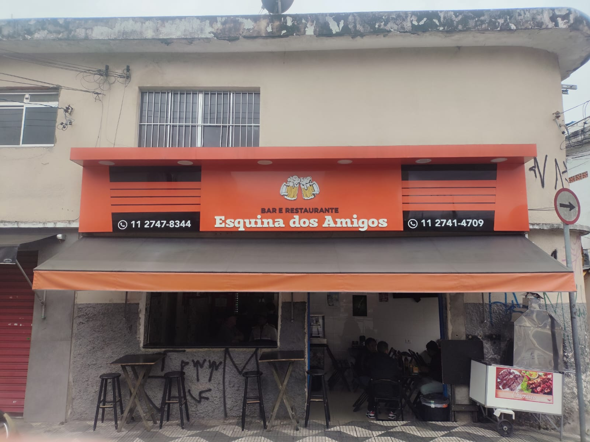
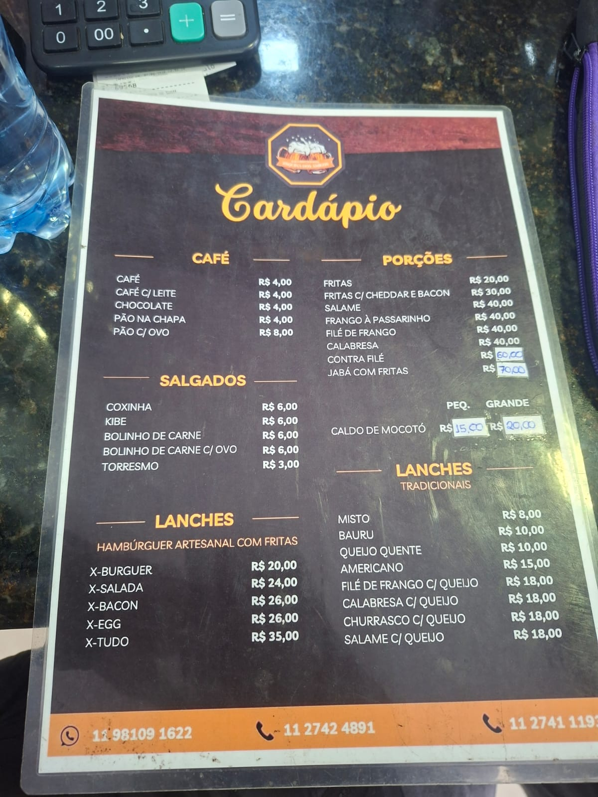
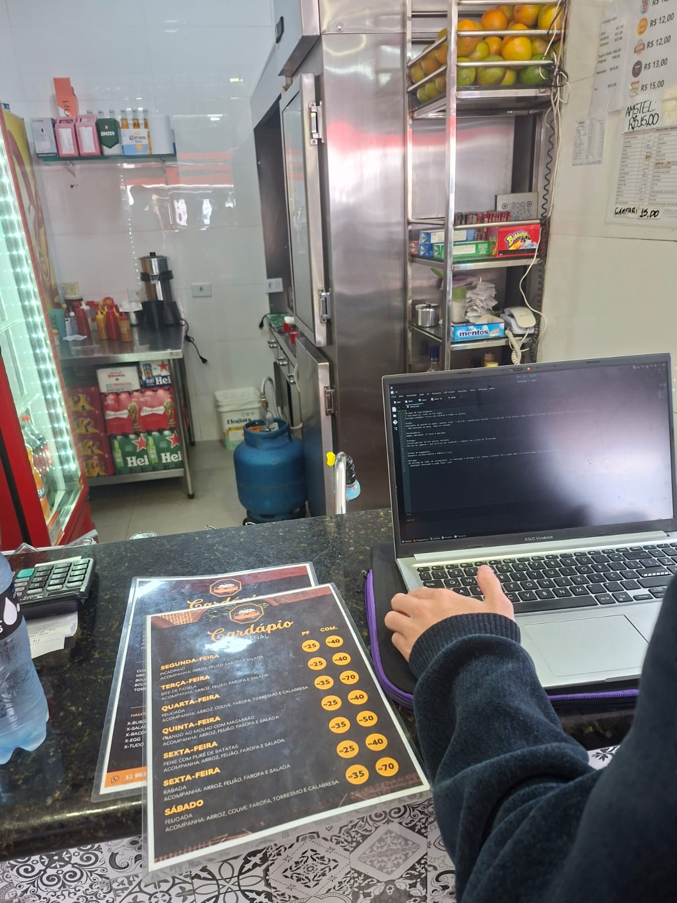
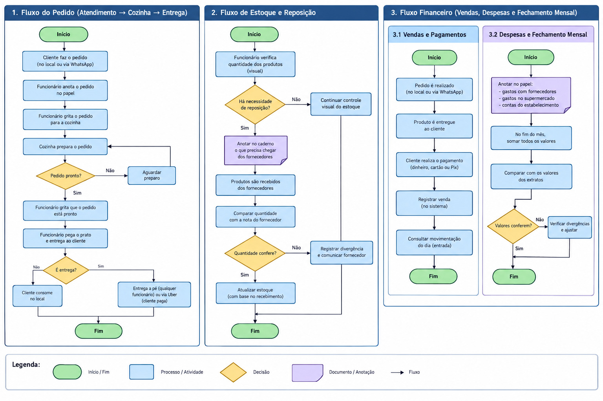
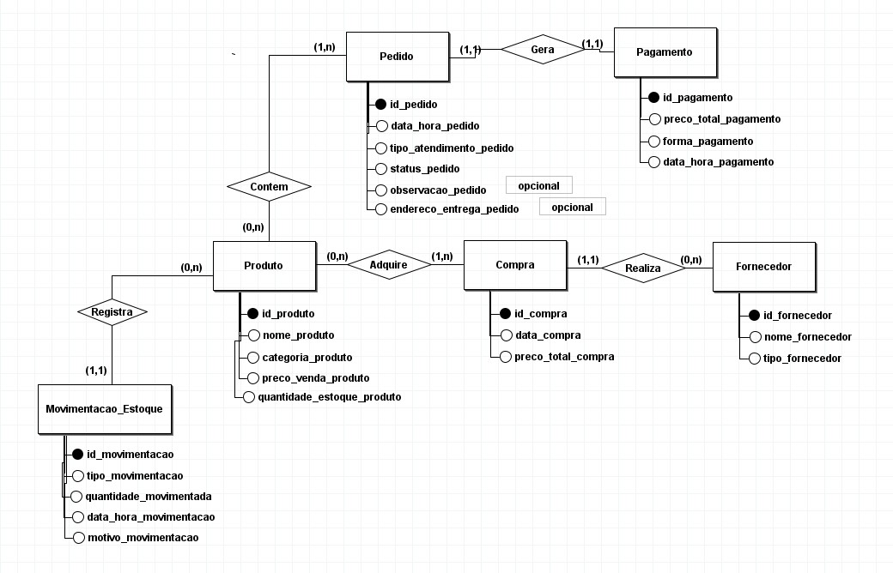
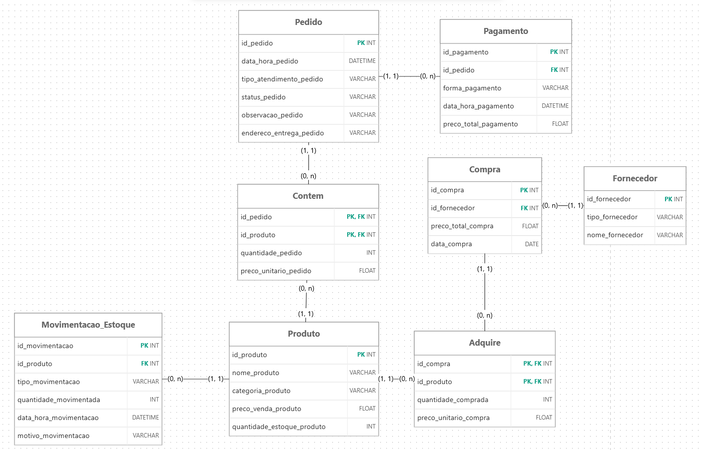

# Entrega 2 — Modelo Lógico, Implementação SQL e Apresentação Final

### Modelagem de um sistema de gestão de informações para uma organização de pequeno porte

**Organização estudada:** Bar e Restaurante Esquina dos Amigos, São Paulo/SP.

> **Critério de entrega:** este `README.md` da raiz da branch `main` é o Relatório Técnico Final. Os demais artefatos devem permanecer em arquivos próprios, referenciados neste relatório. As seções ainda não concluídas são identificadas como pendentes; nenhuma informação de campo, decisão de modelagem ou implementação SQL é presumida.

## 1. Relatório Técnico Final

### Integrantes

| Nome completo | RGM | Usuário do GitHub |
|---|---|---|
| Cauã Francisco Gomes da Silva | 47485990 | A confirmar pelo integrante |
| João Pedro Liberato de Oliveira | 46801375 | A confirmar pelo integrante |
| Marcus Vinicius dos Santos Cruz | 46690069 | A confirmar pelo integrante |
| João Vitor Gonçalves De Oliveira | 47391111 | A confirmar pelo integrante |

### 1.1 Revisão do Modelo Conceitual

Esta seção apresenta a revisão da **mesma organização real utilizada na Entrega 1 (Caso A do Esqueleto 2)**, tomando como referência a [Issue #1 — correção da Entrega 1](https://github.com/Marcuss9/sistema-gestao-bar-restaurante/issues/1), os registros de levantamento e os modelos existentes. Reúne a caracterização, o relato da entrevista, os processos, os requisitos, as regras de negócio, os atributos, os relacionamentos e o estado de revisão do DER conceitual.

**Documentos de apoio:** [levantamento organizado](levantamento/levantamento.md), [evidências e pendências](levantamento/evidencias.md), [perguntas e respostas originais](levantamento/fontes/perguntas-e-respostas.txt), [confirmações documentais](levantamento/fontes/confirmacoes-documentais.md) e [dicionário de dados em HTML](dicionario_dados_conceitual.html).

**Situação:** a documentação foi ampliada e o modelo lógico da seção 1.2 já possui quantidade e preço unitário nas tabelas `Contem` e `Adquire`. Entretanto, o **DER conceitual vinculado nesta seção ainda não contém esses atributos nos relacionamentos N:N**. Permanecem pendentes a validação presencial de volumes, dados e foto da entrevista, a conciliação das novas regras com o modelo lógico e a abrangência dos gastos. A RN15 já foi definida documentalmente como pagamento único no ato, sem fiado. Correções textuais não devem ser confundidas com aprovação do DER ou implementação do sistema.

#### Caracterização da Organização

**Nome e natureza da organização**
Bar e Restaurante Esquina dos Amigos é um estabelecimento comercial do ramo de alimentação, com aproximadamente 20 anos de funcionamento. Sua operação envolve a comercialização de refeições, porções, lanches, bebidas alcoólicas e refrigerantes, incluindo pratos especiais disponibilizados em determinados dias da semana.

**Contexto e porte**
O estabelecimento possui uma operação de pequeno porte. Em atualização documental fornecida pelo integrante em 02/11/2026, a equipe foi informada como **quatro funcionários**. A anotação original registrava três funcionários e o README anterior, quatro pessoas incluindo o proprietário; por isso, o novo número é atribuído explicitamente ao integrante e ainda requer conferência com o responsável quanto à inclusão do proprietário. Não existem funções rigidamente atribuídas aos funcionários: todos podem desempenhar as atividades necessárias de acordo com a demanda do estabelecimento, incluindo atendimento, cozinha, reposição, compras e entregas.
A operação é fortemente baseada na experiência adquirida ao longo dos anos e na familiaridade dos funcionários com o próprio comércio e com seus clientes. Dessa forma, diversas atividades são realizadas de maneira informal e sem registros estruturados, baseando-se principalmente no conhecimento dos funcionários e no acompanhamento visual da operação.
O estabelecimento trabalha com diferentes fornecedores. Entre os fornecedores recorrentes estão Ambev, Heineken e Coca-Cola, enquanto outros produtos e ingredientes são adquiridos diretamente em supermercados.

**Problemas e necessidades identificados**
O principal problema identificado está na baixa formalização dos registros operacionais e financeiros.
Atualmente, as principais informações registradas são:
* produtos que precisam ser recebidos dos fornecedores;
* gastos realizados com fornecedores;
* gastos realizados em supermercados;
* contas do estabelecimento.

Não existe um registro estruturado das vendas realizadas durante o dia. O estabelecimento também não mantém registros de mesa, nome do cliente ou número de comanda.
O controle dos produtos comercializados também não é realizado por meio de um sistema estruturado. A quantidade disponível é acompanhada de maneira visual e informal.

Os problemas passam a ser identificados para rastreabilidade documental:

| Código | Problema identificado | Requisitos relacionados | Limite atual |
|---|---|---|---|
| P1 | Ausência de registro individual das vendas e de visão dos recebimentos do dia | RF02–RF06 | Quantidade e preço por item já constam no modelo lógico; faltam no DER conceitual e nas consultas gerenciais Gxx |
| P2 | Entradas e saídas financeiras dispersas entre papel e extratos | RF07, RF14 | Contas do estabelecimento e data de pagamento das compras não estão plenamente representadas |
| P3 | Estoque e necessidade de reposição acompanhados visualmente | RF09–RF12 | Decidido: estoque mínimo configurável e alerta por produto comercializado; falta incorporar o campo no DER/modelo lógico/dicionário e definir unidades, saldo inicial e ajustes |

Esses códigos ainda precisam ser vinculados às tabelas finais e consultas Gxx pela equipe responsável pelo modelo lógico e SQL. Não há consultas implementadas nesta revisão.

Entre as principais necessidades identificadas estão:
* visualizar quanto dinheiro foi movimentado no dia;
* acompanhar de forma mais clara o que entra e o que sai financeiramente;
* possuir maior visibilidade sobre a movimentação geral do estabelecimento;
* controlar a quantidade disponível dos produtos comercializados;
* registrar movimentações de entrada e saída do estoque.

**Volumes operacionais**
As fontes originais informam aproximadamente 20 anos de funcionamento e o integrante informou **quatro funcionários**. Em 02/11/2026, o integrante esclareceu que **não dispõe de volumes operacionais verificáveis**: pedidos por dia/hora/semana, entregas e compras por período, produtos ativos e movimento real não foram quantificados. A hipótese anterior de 12 pedidos/hora **não será utilizada como dado do estabelecimento, nem como média ou pico informado pela organização**. Para a massa fictícia da Entrega 2, escolher cenários simulados e identificá-los explicitamente como tais, sem atribuí-los à entrevista.

**Escopo do sistema e abrangência da organização**
O sistema proposto reúne cadastro e preços de produtos, pedidos presenciais e para entrega, composição dos pedidos, recebimentos, compras, fornecedores e movimentações de estoque. A venda é representada por Pedido e seus itens, sem entidade Venda separada. O modelo atual não dispõe de cadastros independentes de mesas/comandas, clientes ou funcionários, por decisões anteriores cuja justificativa ainda depende de validação.

O Esqueleto 2 exige cobertura dos dados relevantes de **toda a organização**. A estrutura atual, embora represente vendas, compras e estoque de produtos comercializados, **não cobre integralmente contas do estabelecimento, efetivos pagamentos de compras e registros de divergência na conferência dos recebimentos**. O controle informatizado de ingredientes da cozinha foi expressamente **excluído da RN10 por decisão de escopo do projeto**, sem negar que o restaurante adquire e utiliza esses ingredientes. A lacuna financeira compromete sobretudo a solução completa do problema **P2**. Antes de encerrar a revisão, o grupo deve confirmar quais dados e estruturas adicionais são necessários com o responsável. Não se presume que processos sem evidência deixem de existir.

**Justificativa da escolha**
O estabelecimento foi escolhido por apresentar uma operação real, de pequeno porte e com processos suficientemente definidos para a elaboração de um modelo conceitual de banco de dados.
Apesar de a operação funcionar atualmente com base na experiência dos funcionários e em controles manuais, existem diversos dados relacionados a pedidos, produtos, estoque, fornecedores, compras, pagamentos e entregas que podem ser estruturados em um sistema de gestão.
Esse cenário permite modelar uma solução que não pretende substituir a experiência dos funcionários, mas transformar informações atualmente dispersas ou não registradas em dados estruturados, possibilitando consultas e acompanhamento da operação.

**Evidências da organização**
* Fotos da Visita
  
  
  
  
* Endereço: R. Inês Monteiro, 157 - Artur Alvim, São Paulo - SP, 03568-030
* Telefone: (11) 98109-1622
* Proprietário identificado somente pelo apelido **“Ceará”**, conforme informação complementar do integrante em 02/11/2026; **nome civil não informado**. Ainda falta comprovar se ele foi o entrevistado e registrar os metadados da entrevista.
* [Índice das evidências e lacunas de comprovação](levantamento/evidencias.md).

**Limites das evidências:** as quatro fotos existentes permanecem no repositório como arquivos `.jpeg`; o Esqueleto 2 solicita **JPG ou PNG** e **ao menos uma foto da entrevista no estabelecimento**. A adequação das extensões e a comprovação da entrevista ainda estão pendentes. O cardápio semanal fornecido nesta revisão foi [transcrito](levantamento/fontes/cardapio-semanal-transcricao.md), mas **a imagem original do cardápio ainda não foi incluída nesta branch**. O telefone publicado acima é do estabelecimento; ainda não foi confirmado se é também o contato do responsável entrevistado. Também falta confirmar um link oficial de perfil da organização no Google, se existente.

##### Relato da entrevista e fontes do levantamento

O [levantamento organizado](levantamento/levantamento.md) é o documento Markdown separado requerido pelo Esqueleto 2. Ele sintetiza as [anotações originais](levantamento/fontes/perguntas-e-respostas.txt), as [complementações de 28/10 e 02/11/2026](levantamento/fontes/confirmacoes-documentais.md) e a [transcrição do cardápio semanal fornecido pelo integrante](levantamento/fontes/cardapio-semanal-transcricao.md). O envio do cardápio e as informações do integrante não constituem nova entrevista com o restaurante.

| Informação exigida | Registro comprovável e pendência |
|---|---|
| Proprietário / responsável | Conhecido pelo apelido **“Ceará”**, identificado como proprietário pelo integrante; nome completo desconhecido e condição de entrevistado a comprovar |
| Contato do responsável | Telefone comercial informado na caracterização; contato específico a confirmar |
| Data e horário | Não informados nas fontes |
| Local da entrevista | Visita ao estabelecimento documentada, mas local e contexto exatos da entrevista a confirmar |
| Integrantes presentes | A confirmar |
| Vínculo de integrante com o estabelecimento | A declarar, se houver |
| Evidência fotográfica da entrevista | **Pendente**; as fotos disponíveis não mostram o responsável segundo a Issue #1 |

**Informações relatadas:** registro de pedidos em papel e comunicação verbal com a cozinha; ausência de mesa/comanda; estoque acompanhado visualmente; anotações de gastos e contas; compras com distribuidores e supermercados; entrega local e pagamento pelo cliente de transporte solicitado por aplicativo; tratamento de pedidos errados. O conteúdo detalhado, organizado por processo e com seus limites, está no levantamento Markdown.

**Observação presencial:** as imagens documentam aspectos do local (fachada e ambiente), mas as fontes não distinguem quais procedimentos os integrantes efetivamente **viram acontecer** e quais foram apenas **relatados**. Essa separação deverá ser completada pelo grupo após conferência com os participantes, sem atribuir observação direta sem evidência.

**Confirmações após a Entrega 1:** um integrante confirmou em 28/10/2026 o aceite de vale-refeição, a ausência de frete próprio e que o cliente solicita e paga o transporte por aplicativo. O limite de até dez minutos a pé é **estimativa adotada como critério do projeto**, não uma medição ou confirmação formal do responsável.

**Pendências para completar a entrevista:** nome civil do proprietário/entrevistado, confirmação de quem participou da entrevista, telefone de contato, data, integrantes presentes, local, observações presenciais, eventual vínculo com o estabelecimento e foto da entrevista no local. **Volumes reais indisponíveis** foram registrados como limitação documental, sem números inferidos. Se for necessária nova visita, registrar data, participantes e alterações em relação à Entrega 1.

##### Tratamento dos apontamentos da Entrega 1

Esta tabela atende ao **Caso A** do Esqueleto 2 e registra os apontamentos da [Issue #1](https://github.com/Marcuss9/sistema-gestao-bar-restaurante/issues/1), as providências efetivamente tomadas e as pendências. Uma correção do modelo lógico não é apresentada como correção do DER conceitual.

| Apontamento da correção da E1 | O que mudou no trabalho / situação | Por quê |
|---|---|---|
| **Critério 8 — regras de negócio** insuficientes e sem restrições legais, fiscais e sanitárias | **Revisão documental realizada:** RN13–RN20 acrescentadas, distinguindo práticas descritas, propostas e obrigações; validação de algumas regras continua pendente | Regras precisam ser verificáveis e relacionadas ao funcionamento e às obrigações aplicáveis |
| **Critério 9 — dicionário de dados** limitado a tabelas simples de atributos | **Revisão documental realizada:** HTML alinhado às 8 tabelas e 37 colunas da seção 2, incluindo Contem e Adquire, PKs/FKs, nulidade, unicidade, CHECK propostos, DEFAULT e rastreabilidade RN/RF. Mantidos convenções MySQL, cardinalidades, fluxos, índices, LGPD e logs | Representar os dados e restrições pretendidas sem confundir propostas com SQL implementado |
| **Critério 10 — Pedido–Produto N:N sem quantidade/preço por item** | **Parcial:** adicionados `quantidade_pedido` e `preco_unitario_pedido` à tabela lógica `Contem`; o DER conceitual ainda não mostra esses atributos no relacionamento | Sem os atributos no conceito, não há descrição completa de cada item vendido |
| **Critério 10 — Compra–Produto N:N sem quantidade/preço por item** | **Parcial:** adicionados `quantidade_comprada` e `preco_unitario_compra` à tabela lógica `Adquire`; o DER conceitual ainda não mostra esses atributos no relacionamento | Preservar a quantidade e o custo unitário de cada aquisição |
| **Critério 5 — processos de cardápio, recebimento, contas e reposição parcialmente descritos** | **Parcial:** descrições ampliadas com base no levantamento; horários de pratos especiais, recebimentos parciais, pagamentos de contas e critérios de reposição seguem sem validação | Evitar inventar rotinas e reconhecer dados não cobertos pelo modelo |
| **Pedido–Pagamento 1:1 impede pagamento dividido** | **Pendente de decisão:** mantida a cardinalidade conceitual original; o modelo lógico descreve a futura restrição `UNIQUE`, se o 1:1 for confirmado | Pagamento dividido ou posterior só pode alterar o modelo depois de confirmada sua prática |
| **Movimentações sem referência direta à origem** | **Pendente:** permanece `motivo_movimentacao` textual, sem FK para Pedido ou Compra | Rastreabilidade da operação pode exigir vínculos adicionais |
| **Cobertura de despesas, contas e desembolsos** | **Pendente:** `Compra` indica aquisição e `Pagamento` indica recebimento de vendas, sem representação de todas as saídas efetivamente pagas | O problema P2 requer distinguir valores comprados, devidos e pagos |
| **Comprovação da entrevista e volumes operacionais** | **Pendente:** faltam dados do entrevistado, foto específica, datas e números do movimento | A Entrega 2 exige comprovação da entrevista e volumes para fundamentar a massa de dados |

**Resultado:** os apontamentos sobre regras e dicionário foram tratados **documentalmente**. Os apontamentos N:N estão tratados **no modelo lógico**, mas ainda **não no DER conceitual**; as demais decisões e evidências permanecem registradas como pendentes. Não se declara revisão concluída nem aprovação do DER.

---

---

#### Processos de Negócio

**Principais processos mapeados**
A partir do levantamento realizado, foram identificados os seguintes processos principais:
* Atendimento e registro de pedidos
* Preparação e entrega dos pedidos
* Venda e recebimento do pagamento
* Entrega de pedidos nas proximidades
* Controle de produtos em estoque
* Reposição de produtos
* Registro de compras
* Acompanhamento financeiro

**Atendimento e registro de pedidos**
O cliente realiza o pedido diretamente no estabelecimento ou, no caso de entregas, por meio do WhatsApp.
No atendimento presencial, o funcionário recebe o pedido e faz uma anotação em papel, utilizada para comunicar verbalmente os itens à cozinha. Essa anotação não constitui um registro estruturado de vendas. Não são registrados número da mesa, nome do cliente ou número de comanda.
Em seguida, o funcionário comunica verbalmente o pedido à cozinha.
Nos pedidos destinados à entrega, o cliente informa, por meio do WhatsApp, as informações necessárias para que o pedido seja entregue.

**Preparação e entrega**
A cozinha prepara o pedido com base na comunicação realizada pelo funcionário.
Quando o pedido fica pronto, os funcionários comunicam verbalmente que ele está disponível. Um funcionário pode realizar a entrega do prato ao cliente, porém não existe uma pessoa exclusivamente responsável por essa atividade.
Todos os funcionários podem executar as tarefas necessárias conforme a demanda.

**Venda e pagamento**
O estabelecimento aceita:
* dinheiro;
* cartão de crédito;
* cartão de débito;
* vale refeição.
* Pix.

Atualmente, as vendas não são registradas individualmente em um sistema.
A solução proposta deverá permitir registrar cada operação comercial e relacioná-la ao respectivo pedido e pagamento.

**Entregas**
O estabelecimento realiza entregas apenas nas proximidades.
Os pedidos podem ser realizados pelo WhatsApp e a entrega pode ser realizada a pé por qualquer funcionário.
Em determinadas situações, clientes solicitam um Uber para retirada do pedido. Nesse caso, o custo do transporte é pago pelo próprio cliente.
Não existe um funcionário exclusivamente responsável pelas entregas.
Não é cobrado frete próprio para as entregas locais, conforme confirmação complementar do integrante. Para delimitar as proximidades, o projeto adota trajetos de até dez minutos a pé a partir do estabelecimento na R. Inês Monteiro, 157. Esse critério foi estimado e aceito pelo integrante; não resulta de medição em campo.

**Controle de produtos em estoque**
Atualmente, o estabelecimento não realiza um controle estruturado de estoque por sistema.
A quantidade dos produtos comercializados é acompanhada de maneira informal e visual.
A solução proposta deverá permitir registrar a quantidade disponível dos produtos comercializados e suas respectivas movimentações de entrada e saída.
O controle estruturado **não abrange ingredientes utilizados na cozinha**, conforme decisão de escopo RN10 reafirmada pelo integrante em 02/11/2026. Trata-se de uma delimitação do sistema, não de evidência de que o estabelecimento não compre ingredientes; os gastos correspondentes continuam relevantes para o acompanhamento financeiro.

**Compras**
As compras são realizadas pelos próprios funcionários, conforme a necessidade do estabelecimento.
Os produtos comercializados podem ser adquiridos de fornecedores recorrentes, como Ambev, Heineken e Coca-Cola.
Ingredientes utilizados na preparação dos alimentos também podem ser adquiridos diretamente em supermercados.
Os gastos com fornecedores e supermercados são anotados manualmente. No sistema proposto, `Compra` identifica fornecedor, data e valor total, enquanto `Adquire` registra produto, quantidade comprada e preço unitário da aquisição. Esses atributos já constam do modelo lógico, mas ainda faltam no DER conceitual. A compra e seu pagamento são fatos distintos: as fontes não informam prazos nem formas de pagamento dos fornecedores, que permanecem pendentes.

**Acompanhamento financeiro**
Atualmente, os registros financeiros são realizados manualmente e posteriormente comparados com os extratos financeiros.
A solução proposta deverá permitir maior visibilidade sobre as entradas e saídas financeiras, possibilitando consultas sobre a movimentação diária e outros períodos.

##### Cardápio e preços

O estabelecimento possui cardápio físico com produtos e valores. Comercializa PFs, porções, lanches, pratos especiais por dia da semana, bebidas alcoólicas e refrigerantes. Uma imagem de **cardápio semanal enviada pelo integrante em 02/11/2026** traz os pratos e valores abaixo. A [transcrição integral, incluindo acompanhamentos e ressalvas](levantamento/fontes/cardapio-semanal-transcricao.md) foi registrada separadamente; a imagem original ainda precisa ser adicionada ao repositório.

| Dia indicado na imagem | Prato | PF | COM. |
|---|---|---:|---:|
| Segunda-feira | Picadinho | R$ 25,00 | R$ 40,00 |
| Terça-feira | Bife de panela | R$ 25,00 | R$ 40,00 |
| Quarta-feira | Feijoada | R$ 35,00 | R$ 70,00 |
| Quinta-feira | Frango ao molho com macarrão | R$ 25,00 | R$ 40,00 |
| Sexta-feira | Peixe com purê de batatas | R$ 35,00 | R$ 50,00 |
| Sexta-feira (segunda ocorrência) | Rabada | R$ 25,00 | R$ 40,00 |
| Sábado | Feijoada | R$ 35,00 | R$ 70,00 |

**Limites:** a fonte repete **sexta-feira** e não indica domingo; não se presume qual dia seria correto para Rabada. As colunas aparecem como **PF** e **COM.**, sem significado detalhado para “COM.”. Não há data de vigência dos valores, horário de oferta ou confirmação de disponibilidade atual. O modelo lógico contém um preço atual por Produto e ainda precisa decidir como representar as duas modalidades comerciais e a disponibilidade por dia para aplicar RN16. O preço praticado em cada item já é preservado no modelo lógico como `preco_unitario_pedido`, mas falta sua representação conceitual; o preço atual do cadastro não substitui o histórico.

##### Reposição, recebimento e conferência

A equipe identifica visualmente a necessidade de reposição, inclusive pelo último pacote restante, e anota no caderno os produtos esperados dos fornecedores. No recebimento, compara os registros com a nota do fornecedor. **Para o sistema proposto**, o integrante decidiu cadastrar estoque mínimo por produto comercializado, alertar quando o saldo for menor ou igual ao mínimo e registrar diferenças entre quantidades esperadas e recebidas para resolução com o fornecedor. Essas decisões não comprovam uma rotina informatizada atual; unidades, valores mínimos iniciais e entregas parciais ainda precisam de detalhamento.

Na solução proposta, compras identificam fornecedor, data e valor total; as movimentações de estoque registram produto, entrada/saída, quantidade, data/hora e motivo. Quantidade e preço por item já constam no modelo lógico, mas precisam ser representados no DER conceitual; o vínculo com a quantidade efetivamente recebida continua pendente. O alerta por estoque mínimo e o registro de divergências são requisitos futuros; o modelo lógico vigente ainda não contém todos os campos ou vínculos necessários e deverá ser revisado pelos responsáveis técnicos.

##### Contas e acompanhamento dos gastos

São anotados gastos com fornecedores, supermercado e contas do estabelecimento. O fechamento relatado é mensal, com uso de extratos para comparação com os gastos. Não há registro diário individualizado das vendas.

A necessidade de visualizar entradas e saídas exige distinguir valor vendido, valor recebido, valor comprado e valor efetivamente pago. Datas de vencimento/pagamento, categorias das contas, taxas e controles de dinheiro não foram informados. A cobertura das contas e dos pagamentos das compras precisa ser discutida com a equipe de modelagem; esta revisão não cria entidade Despesa.

##### Pedido errado

Segundo as anotações originais, quando ocorre pedido errado, os funcionários podem consumir o prato e o estabelecimento arca com a diferença, ou o cliente pode aceitar o prato e pagar seu valor. Como **decisão para a solução**, o integrante definiu que o cancelamento comum será permitido antes do início do preparo. Isso não foi registrado como prática observada na entrevista. Estornos, autorização e diferença de valores em pratos preparados incorretamente continuam sem procedimento confirmado, conforme RN14.

##### Limites e processos a confirmar

A ausência de mesa/comanda e de cargos fixos está relatada. A exclusão de cadastros permanentes de clientes e funcionários permanece uma decisão do modelo atual. O integrante reafirmou a **exclusão de ingredientes do controle de estoque** na RN10; não se conclui com isso que os processos de compra e preparo desses ingredientes não existam. A equipe deverá justificar a delimitação perante a exigência de cobertura da Entrega 2.

Escalas, validade de alimentos, rotina fiscal e detalhes do fechamento não estão confirmados nas fontes. **Para o projeto**, a RN15 já exclui pagamento posterior/fiado e divisão entre modalidades, mas o instante exato da cobrança (antes ou depois do preparo) ainda precisa ser confirmado no estabelecimento. Não há evidência de necessidade de QR Code, recomendação automática ou outro canal de venda adicional.

**Fluxogramas**
* 

---

---

#### Requisitos do Sistema

##### Requisitos Funcionais

Os requisitos descrevem a solução proposta, não funcionalidades implantadas. Os códigos são preservados; os campos abaixo usam o vocabulário atual, com dependências do modelo explicitadas.

* **RF01 — Cadastrar produtos:** Registrar identificador, nome, categoria, preço atual de venda, saldo e **estoque mínimo configurável** de cada produto comercializado sujeito a controle. Ingredientes de cozinha permanecem fora do escopo (RN10). O campo de estoque mínimo ainda precisa ser incorporado ao modelo e ao dicionário; categorias e unidades devem ser validadas.
* **RF02 — Registrar pedidos:** Registrar identificador único, data/hora, tipo de atendimento, situação e observação opcional; para entrega, registrar endereço. A solução deve distinguir pedido ainda não iniciado na cozinha de pedido em preparo, para aplicar a RN14; os estados e sua representação no modelo precisam ser definidos.
* **RF03 — Registrar os itens de um pedido:** Associar um ou mais produtos ao pedido, com quantidade e preço unitário praticado. Os atributos por item já foram incorporados à tabela lógica `Contem`; falta representá-los no DER conceitual revisado.
* **RF04 — Registrar a forma de pagamento:** Registrar identificador, valor recebido, uma única modalidade (dinheiro, crédito, débito, vale-refeição ou Pix) e data/hora, associado ao pedido. A RN15 define pagamento no ato, sem fiado nem divisão; a equipe técnica deve tratar pedidos cancelados antes de pagamento e o momento exato da cobrança.
* **RF05 — Registrar vendas:** Identificar a operação comercial pelo Pedido e seus itens, preservando quantidade e preço praticado, e relacionar os recebimentos. Não confundir valor vendido com valor recebido.
* **RF06 — Consultar movimentação diária:** Consultar valores recebidos por data e forma de pagamento, utilizando valor e data/hora de Pagamento. A data de venda utiliza Pedido e deve ser distinguida da data de recebimento.
* **RF07 — Registrar compras:** Registrar identificador, fornecedor, data e valor total, com produtos, quantidades e preços de aquisição por item. Os atributos por item já foram incorporados à tabela lógica `Adquire`; falta representá-los no DER conceitual revisado.
* **RF08 — Registrar fornecedores:** Registrar identificador, nome e classificação do fornecedor, incluindo distribuidores recorrentes e supermercados; o domínio da classificação deve ser validado.
* **RF09 — Acompanhar necessidade de abastecimento:** Cadastrar e consultar o estoque mínimo de cada produto controlado, comparar com o saldo disponível e **alertar quando o saldo for menor ou igual ao mínimo** (RN07). O processo atual é visual; o parâmetro e o alerta são decisões do sistema proposto, ainda não refletidas integralmente no modelo lógico.
* **RF10 — Registrar recebimento de produtos:** Registrar produto, quantidade esperada, quantidade efetivamente recebida, diferença identificada, data e referência à compra/documento para conferência e resolução junto ao fornecedor (RN08). A forma de registrar entregas parciais/devoluções e os vínculos no modelo ainda dependem da equipe técnica e validação operacional.
* **RF11 — Registrar movimentações de estoque:** Registrar identificador, produto, entrada/saída, quantidade positiva, data/hora e motivo. A origem em venda, compra, perda ou ajuste deve ter sua representação definida pela equipe.
* **RF12 — Consultar informações de estoque:** Consultar saldo por produto e histórico de entradas/saídas com quantidade, data/hora e motivo. A conciliação exige definir saldo inicial e unidades.
* **RF13 — Registrar pedidos para entrega:** Identificar o tipo de atendimento e o endereço do pedido, respeitando a área adotada na RN03, a entrega local sem frete da RN12 e o transporte contratado pelo cliente da RN05. A representação da modalidade de retirada/entrega precisa ser alinhada ao modelo.
* **RF14 — Consultar entradas e saídas financeiras:** Consultar recebimentos e gastos por período, distinguindo compras, contas e pagamentos. O modelo atual cobre Pagamento e Compra, mas ainda não representa integralmente as contas nem os desembolsos; essa lacuna precisa ser resolvida pela equipe para atender P2.

##### Requisitos Não Funcionais
Os seguintes requisitos são propostos para a solução, não constituindo características atualmente observadas na organização:
* **RNF01 — Usabilidade:** O sistema deve possuir uma interface simples, considerando que a operação atual é realizada de maneira informal e sem um sistema de gestão estruturado.
* **RNF02 — Disponibilidade:** O sistema deve estar disponível durante o período de funcionamento do estabelecimento para permitir o registro das operações.
* **RNF03 — Integridade dos dados:** Os registros devem manter consistência entre pedidos, produtos, pagamentos, compras, estoque e movimentações financeiras.
* **RNF04 — Segurança:** O acesso aos dados administrativos, financeiros e pessoais deve depender de autenticação e permissões por perfil de acesso, sem exigir vínculo obrigatório de cada operação a uma entidade Funcionário (RN11); os perfis ainda precisam ser definidos.
* **RNF05 — Desempenho:** O sistema deve responder às operações de cadastro, consulta e registro das operações cotidianas em até 3 segundos em condições normais de uso.
* **RNF06 — Manutenibilidade:** O sistema deve ser estruturado de forma organizada, permitindo a manutenção e evolução de suas funcionalidades sem comprometer os dados já registrados.

**Critérios de conferência dos RNF**

| Código | Como conferir / decisão necessária |
|---|---|
| RNF01 | Validar com representante da operação as tarefas de registrar pedido, recebimento e consulta diária; participantes, roteiro e critério de aceitação ainda devem ser definidos |
| RNF02 | Confirmar dias/horários de funcionamento e meta de disponibilidade antes da avaliação |
| RNF03 | Conferir referências, obrigatoriedade, domínios, totais e consistência de estoque no modelo e nas consultas de auditoria |
| RNF04 | Definir perfis e conferir operações permitidas/negadas, especialmente endereço de entrega e informações financeiras |
| RNF05 | Manter 3 segundos como meta proposta; definir volume, equipamento, concorrência e consultas antes de medir |
| RNF06 | Conferir consistência entre README, dicionário e modelos, e documentar alterações; resta definir procedimento de evolução do banco |

---

---

#### Regras de Negócio

As regras a seguir estão separadas em **regras operacionais**, **regras propostas que dependem de validação** e **restrições legais, sanitárias, fiscais e de privacidade**. Propostas não devem ser confundidas com práticas confirmadas na entrevista. A presente atualização textual não modifica o arquivo gráfico do DER, cuja revisão está indicada adiante.

##### Regras operacionais e de escopo

* **RN01 — Formas de pagamento:** As vendas podem ser pagas em dinheiro, cartão de crédito, cartão de débito, vale-refeição ou Pix. O registro de cada pagamento deve indicar uma das modalidades aceitas.
* **RN02 — Execução das atividades:** As atividades de atendimento, preparo, compras, reposição e entregas podem ser desempenhadas pelos funcionários conforme a demanda, sem exigência de cargo fixo para cada operação.
* **RN03 — Área de entrega:** O restaurante realiza entregas próprias apenas nas proximidades do estabelecimento. Para o projeto, adota-se o limite de até dez minutos de trajeto a pé a partir da R. Inês Monteiro, 157, Parque Arthur Alvim. O critério decorre de estimativa aceita pelo integrante responsável pela revisão em 28/10/2026; não corresponde a um raio medido nem a uma confirmação de campo.
* **RN04 — Entrega a pé:** As entregas locais podem ser realizadas a pé por qualquer funcionário, sem a designação obrigatória de um entregador exclusivo.
* **RN05 — Transporte por aplicativo:** Quando houver transporte por aplicativo para retirada do pedido, o próprio cliente solicita o serviço e paga o transporte. O restaurante não é responsável por contratar esse transporte, conforme anotações originais e confirmação complementar do integrante.
* **RN06 — Identificação do fornecedor:** Toda compra registrada deve identificar seu fornecedor, inclusive quando realizada em supermercado, sem limitar o cadastro a uma lista fixa de empresas.
* **RN07 — Reposição de estoque:** Hoje a necessidade de reposição é identificada visualmente, inclusive pelo último pacote. **Decisão do projeto (02/11/2026):** cada produto comercializado sob controle deverá ter estoque mínimo configurável, e o sistema alertará quando o saldo registrado for menor ou igual a esse mínimo. A definição dos valores iniciais, unidades e o acréscimo do atributo ao modelo/dicionário permanecem pendentes; não há entidade própria de Reposição.
* **RN08 — Conferência do recebimento:** A rotina relatada compara o caderno com a nota do fornecedor. **Decisão do projeto (02/11/2026):** registrar as quantidades esperadas e recebidas, identificar divergências e mantê-las documentadas para resolução com o fornecedor. Devoluções, entregas parciais e como cada diferença afeta a entrada de estoque continuam pendentes de detalhamento; não se presume bloqueio automático.
* **RN09 — Identificação do pedido:** Cada pedido registrado deve possuir identificador único, sem exigir identificação de mesa, comanda ou cadastro de cliente, pois tais controles não integram a operação modelada.
* **RN10 — Limite do controle de estoque:** O estoque estruturado abrangerá **somente produtos comercializados sob controle**, sem cadastrar ou movimentar ingredientes da cozinha. A delimitação original foi reafirmada pelo integrante em 02/11/2026; compras e gastos com ingredientes continuam relevantes para os registros financeiros, sem exigir controle de quantidade por insumo.
* **RN11 — Identificação do funcionário e acesso:** Por decisão do projeto (02/11/2026), pedidos, compras e movimentações não exigirão a identificação do funcionário executor em cada registro, nem entidade Funcionário no modelo conceitual atual. O acesso ao sistema, porém, dependerá de perfis e permissões; forma de autenticação, papéis e eventual identificação técnica de sessão ainda devem ser definidos (RNF04/RN20).
* **RN12 — Cobrança de entrega:** O restaurante não cobra frete próprio nas entregas locais. O custo do transporte por aplicativo solicitado pelo cliente, previsto na RN05, não corresponde a frete cobrado pelo estabelecimento.

##### Exceções, regras propostas e decisões pendentes

A RN13 continua proposta e a RN16 possui **cardápio semanal documental**, com duas entradas de sexta-feira e sem informação sobre vigência ou horários. As **RN14 e RN15 foram definidas como decisões do projeto em 02/11/2026**, sem comprovação de uma nova entrevista: cancelamento somente antes de iniciar o preparo e pagamento no ato, único, sem fiado ou divisão. Detalhes de estorno e do procedimento para pedido preparado incorretamente permanecem pendentes.

* **RN13 — Venda com estoque insuficiente (proposta):** Para produtos controlados em estoque, a confirmação de uma venda não deverá gerar saldo negativo. Quantidades insuficientes deverão ser revisadas; o tratamento de exceções e diferenças entre saldo físico e registrado depende de validação com o estabelecimento.
* **RN14 — Pedido errado, cancelamento ou troca:** O relato original informa que, diante de prato preparado incorretamente, os funcionários podem consumi-lo e o estabelecimento arca com a diferença, ou o cliente aceita o prato e paga seu valor. **Decisão do projeto (02/11/2026):** o cancelamento comum de pedido é permitido **somente antes do início do preparo**, com registro da ocorrência e preservação do histórico. A exceção de prato errado não é tratada automaticamente como cancelamento comum. Estornos, autorizações, diferenças de valores e efeito no estoque dependem de regras complementares.
* **RN15 — Pagamento único e no ato (decisão do projeto):** Para a solução proposta, o pagamento deverá ser realizado no ato da operação, em **uma única modalidade por pedido**, sem fiado, parcelamento interno ou divisão entre formas de pagamento. A informação é decisão do integrante em 02/11/2026, não confirmação registrada em entrevista. O momento exato em relação ao preparo e o tratamento de pedidos cancelados antes de pagar ou já pagos ainda exigem definição; a equipe deve conferir a correspondência com a cardinalidade Pedido–Pagamento.
* **RN16 — Pratos especiais por dia:** O sistema deverá respeitar a oferta anunciada por dia no [cardápio semanal fornecido pelo integrante](levantamento/fontes/cardapio-semanal-transcricao.md), preservando pratos e preços como dados documentais sem vigência confirmada. A imagem contém **duas ocorrências de sexta-feira** (peixe com purê e rabada); não se pode decidir que uma delas corresponde a outro dia. O horário da oferta, o significado de “COM.” e o procedimento de atualização de preços/disponibilidade ainda precisam de validação. O modelo lógico atual não dispõe de atributo próprio para dia ou variante de preço, exigindo decisão dos responsáveis técnicos antes de automatizar a RN16.

##### Restrições legais, sanitárias, fiscais e de privacidade

As obrigações abaixo decorrem das normas aplicáveis ao estabelecimento; sua documentação não significa que as funcionalidades correspondentes já estejam implementadas.

* **RN17 — Proibição de venda de bebidas alcoólicas a menores:** É proibido vender, fornecer ou servir bebidas alcoólicas a crianças ou adolescentes, nos termos dos arts. 81, II, e 243 do Estatuto da Criança e do Adolescente (Lei nº 8.069/1990).
* **RN18 — Boas práticas sanitárias:** A manipulação, preparação, conservação, armazenamento e validade dos alimentos devem observar as normas sanitárias aplicáveis a serviços de alimentação, incluindo a RDC Anvisa nº 216/2004 e regras locais pertinentes. A ausência de controle informatizado dos ingredientes não afasta essas obrigações.
* **RN19 — Documentação fiscal:** As vendas devem cumprir as obrigações de documentação fiscal aplicáveis, incluindo a emissão de NFC-e no varejo paulista quando exigida, e as compras devem respeitar a documentação fiscal pertinente. Esta regra não pressupõe a implementação de um módulo fiscal nesta entrega.
* **RN20 — Proteção de dados e controle de acesso:** As informações pessoais necessárias para entregas devem ser tratadas somente para finalidades legítimas, com coleta limitada ao necessário e acesso autorizado. Informações administrativas e financeiras devem ter acesso restrito, em consonância com a LGPD (Lei nº 13.709/2018) e o RNF04.

##### Restrições organizacionais e decisões de escopo

O integrante informou **quatro funcionários** em 02/11/2026 (as anotações anteriores diziam três e o README antigo, quatro pessoas incluindo o proprietário); resta confirmar com o responsável se o proprietário está incluído nessa contagem. O estabelecimento utiliza processos predominantemente informais, com dependência da experiência da equipe. Essas características contextualizam o projeto, **mas não substituem regras operacionais verificáveis**.

Por decisões de escopo, a modelagem desta entrega não prevê cadastro independente de Cliente ou Funcionário, identificação por mesa ou comanda, controle estruturado de ingredientes (RN10) nem entidade própria de Reposição. Os perfis de acesso da RN11 não exigem atribuir um funcionário executor a cada pedido. Pedido representa a operação comercial, mantendo o escopo de registros de pedidos, pagamentos, compras, fornecedores e movimentações dos produtos controlados em estoque.

---

---

#### Dicionário de Dados Conceitual

Consulte o [Dicionário de Dados HTML da Entrega 2](dicionario_dados_conceitual.html), arquivo único com **as 8 tabelas e 37 colunas do modelo lógico relacional** (seção 2), incluindo `Contem` e `Adquire` com chaves compostas. Cada coluna documenta tipo MySQL, obrigatoriedade, PK/FK, unicidade, domínio/CHECK, DEFAULT e regras RN/RF associadas. Os campos monetários do brModelo (FLOAT) são descritos como `DECIMAL(12,2)` no MySQL; tamanhos de VARCHAR são propostas físicas. **Restrições documentadas ainda não equivalem a SQL implementado.** As tabelas de atributos resumidas abaixo apresentam apenas as seis entidades do DER **conceitual**, sem substituir o dicionário completo do modelo lógico.

##### Produto
| Atributo | Descrição | Regra de negócio associada |
|----------|-----------|------------------------------|
| id_produto | Identificador único do produto | Deve identificar exclusivamente cada produto |
| nome_produto | Nome do produto | Obrigatório |
| categoria_produto | Categoria do produto | Deve permitir classificar o produto |
| preco_venda_produto | Preço praticado na venda do produto | Deve representar o preço atual |
| quantidade_estoque_produto | Quantidade atualmente disponível em estoque | Deve representar o saldo atualizado do produto |

##### Pedido
| Atributo | Descrição | Regra de negócio associada |
|----------|-----------|------------------------------|
| id_pedido | Identificador único do pedido | Deve identificar exclusivamente cada pedido |
| data_hora_pedido | Data e horário em que o pedido foi feito | Obrigatório |
| tipo_atendimento_pedido | Identifica atendimento presencial ou entrega | Deve permitir diferenciar os tipos de atendimento |
| status_pedido | Situação atual do pedido | Deve representar o andamento do pedido |
| observacao_pedido | Informações adicionais do pedido | Opcional |
| endereco_entrega_pedido | Local informado para pedidos de entrega | Obrigatório quando o pedido for destinado à entrega |

##### Pagamento
| Atributo | Descrição | Regra de negócio associada |
|----------|-----------|------------------------------|
| id_pagamento | Identificador único do pagamento | Deve identificar exclusivamente o pagamento |
| preco_total_pagamento | Preço/montante pago | Deve corresponder ao montante da operação |
| forma_pagamento | Forma utilizada no pagamento | Dinheiro, crédito, débito, vale refeição ou Pix |
| data_hora_pagamento | Momento em que o pagamento foi realizado | Obrigatório |

##### Fornecedor
| Atributo | Descrição | Regra de negócio associada |
|----------|-----------|------------------------------|
| id_fornecedor | Identificador único do fornecedor | Deve identificar exclusivamente o fornecedor |
| nome_fornecedor | Nome do fornecedor | Obrigatório |
| tipo_fornecedor | Classificação do fornecedor | Pode distinguir fornecedor recorrente de supermercado |

##### Compra
| Atributo | Descrição | Regra de negócio associada |
|----------|-----------|------------------------------|
| id_compra | Identificador único da compra | Deve identificar exclusivamente a compra |
| data_compra | Data de realização da compra | Obrigatório |
| preco_total_compra | Preço total da compra | Deve corresponder à soma dos itens adquiridos |

A referência ao fornecedor da compra será implementada no **modelo lógico** com `Compra.id_fornecedor`; no DER conceitual, ela é expressa pelo relacionamento Compra–Fornecedor, não por uma FK desenhada na entidade.

##### Movimentacao_Estoque
| Atributo | Descrição | Regra de negócio associada |
|----------|-----------|------------------------------|
| id_movimentacao | Identificador único da movimentação | Deve identificar exclusivamente o registro |
| tipo_movimentacao | Tipo de movimentação (Entrada ou Saída) | Deve especificar se o estoque aumentou ou diminuiu |
| quantidade_movimentada | Quantidade de itens movimentados | Deve ser positiva |
| data_hora_movimentacao | Data e horário da movimentação | Obrigatório |
| motivo_movimentacao | Motivo da entrada ou saída | Ex: Compra, Venda, Perda, Ajuste |

---

---

#### Modelagem Conceitual (Entidades, Atributos e Relacionamentos)

A modelagem conceitual foi elaborada a partir dos processos de negócio, requisitos, regras de negócio e do Dicionário de Dados Conceitual definidos para o **Bar e Restaurante Esquina dos Amigos**.

O objetivo desta etapa é representar, de forma independente da implementação física do banco de dados, as principais entidades necessárias ao sistema, seus atributos, relacionamentos, cardinalidades e restrições organizacionais.

##### Entidades reconhecidas

A partir do levantamento realizado e das necessidades identificadas no estabelecimento, foram reconhecidas as seguintes entidades:

- **Produto:** representa os produtos comercializados pelo estabelecimento e controlados em estoque.

- **Pedido:** representa uma solicitação de produtos realizada por um cliente. No modelo proposto, o Pedido corresponde à operação comercial registrada pelo sistema, não sendo necessária uma entidade Venda separada.

- **Pagamento:** representa o recebimento associado a um pedido, armazenando as informações referentes ao valor, forma e momento do pagamento.

- **Fornecedor:** representa empresas, supermercados ou outros estabelecimentos responsáveis pelo fornecimento de produtos ao restaurante.

- **Compra:** representa uma aquisição de produtos realizada pelo estabelecimento junto a um fornecedor.

- **Movimentacao_Estoque:** representa os registros de entrada e saída dos produtos, permitindo acompanhar e justificar as alterações ocorridas no estoque.

As entidades **Cliente** e **Funcionario** não foram incluídas no modelo conceitual por decisão de escopo anterior. O anexo relata ausência de nome do cliente nos pedidos e de cargos fixos; a dispensa de cadastro permanente e de identificação de executor precisa ter sua justificativa validada. Nos pedidos destinados à entrega, as informações necessárias são registradas diretamente no próprio Pedido.

Também não foi criada uma entidade **Venda**, pois o Pedido já representa a operação comercial realizada pelo estabelecimento.

Os relacionamentos `Contem` (Pedido–Produto) e `Adquire` (Compra–Produto) continuam N:N no DER conceitual. No modelo lógico, eles já foram convertidos nas tabelas associativas homônimas, equivalentes às estruturas `Item_Pedido` e `Item_Compra`. Os quatro atributos de quantidade e preço já existem na conversão lógica, mas ainda devem ser desenhados nos relacionamentos conceituais.

##### Atributos e classificações

Os atributos definidos para cada entidade são:

| Entidade | Atributos |
|---|---|
| **Produto** | `id_produto`, `nome_produto`, `categoria_produto`, `preco_venda_produto`, `quantidade_estoque_produto` |
| **Pedido** | `id_pedido`, `data_hora_pedido`, `tipo_atendimento_pedido`, `status_pedido`, `observacao_pedido`, `endereco_entrega_pedido` |
| **Pagamento** | `id_pagamento`, `preco_total_pagamento`, `forma_pagamento`, `data_hora_pagamento` |
| **Fornecedor** | `id_fornecedor`, `nome_fornecedor`, `tipo_fornecedor` |
| **Compra** | `id_compra`, `data_compra`, `preco_total_compra` |
| **Movimentacao_Estoque** | `id_movimentacao`, `tipo_movimentacao`, `quantidade_movimentada`, `data_hora_movimentacao`, `motivo_movimentacao` |

Os identificadores iniciados por `id_` identificam as entidades. Os relacionamentos conceituais são convertidos em chaves estrangeiras apenas no modelo lógico.

**Atributos dos relacionamentos N:N pendentes no DER conceitual revisado:**

| Relacionamento conceitual | Atributo que deve ser acrescentado | Finalidade |
|---|---|---|
| Pedido — **Contem** — Produto | `quantidade_pedido` | Quantidade do produto vendido em cada pedido |
| Pedido — **Contem** — Produto | `preco_unitario_pedido` | Preço unitário praticado naquela venda |
| Compra — **Adquire** — Produto | `quantidade_comprada` | Quantidade do produto adquirida na compra |
| Compra — **Adquire** — Produto | `preco_unitario_compra` | Preço unitário de aquisição |

Na notação do brModelo exigida pelo Esqueleto 2, esses atributos devem estar **ligados aos losangos dos relacionamentos**, ou às entidades associativas adequadas se o grupo optar por essa representação. Não se desenham FKs no DER conceitual.

No Pedido, `observacao_pedido` é opcional, pois nem todo pedido necessita de uma observação adicional. O atributo `endereco_entrega_pedido` também é opcional, sendo necessário apenas quando o tipo de atendimento corresponder a uma entrega.

Os demais atributos representam informações necessárias para caracterizar e acompanhar cada ocorrência das entidades dentro dos processos do estabelecimento.

##### Relacionamentos pertinentes

As entidades estão conectadas pelos seguintes relacionamentos:

###### Produto — Movimentacao_Estoque

Um **Produto pode possuir nenhuma ou várias Movimentações de Estoque**, enquanto cada **Movimentacao_Estoque está relacionada a exatamente um Produto**.

**Cardinalidade:**

- Produto: `(0,n)`
- Movimentacao_Estoque: `(1,1)`

Esse relacionamento permite registrar e acompanhar as entradas e saídas relacionadas a cada produto.

###### Pedido — Produto

Um **Pedido contém um ou vários Produtos**, enquanto um Produto pode estar presente em nenhum ou em vários Pedidos.

**Cardinalidade:**

- Pedido: `(1,n)`
- Produto: `(0,n)`

É um relacionamento **N:N**. O diagrama conceitual ainda deve representar no losango `Contem` a quantidade e o preço unitário praticado.

###### Pedido — Pagamento

Um **Pedido gera exatamente um Pagamento**, e cada Pagamento está relacionado a exatamente um Pedido.

**Cardinalidade:**

- Pedido: `(1,1)`
- Pagamento: `(1,1)`

Esse relacionamento representa o pagamento correspondente à operação comercial registrada pelo pedido.

###### Compra — Produto

Uma **Compra adquire um ou vários Produtos**, enquanto um Produto pode estar presente em nenhuma ou em várias Compras.

**Cardinalidade:**

- Compra: `(1,n)`
- Produto: `(0,n)`

É um relacionamento **N:N**. O diagrama conceitual ainda deve representar no losango `Adquire` a quantidade e o preço unitário de aquisição.

###### Fornecedor — Compra

Um **Fornecedor pode estar relacionado a nenhuma ou várias Compras**, enquanto cada Compra está relacionada a exatamente um Fornecedor.

**Cardinalidade:**

- Fornecedor: `(0,n)`
- Compra: `(1,1)`

Esse relacionamento permite identificar o fornecedor responsável por cada aquisição realizada pelo estabelecimento.

##### Restrições e políticas organizacionais aplicadas ao modelo

As seguintes regras e características observadas no estabelecimento influenciaram diretamente a construção do modelo conceitual:

- As vendas podem ocorrer de forma **presencial ou por entrega**.

- Pedidos destinados à entrega devem possuir as informações de localização necessárias para que o atendimento seja realizado.

- O pagamento pode ser realizado em **dinheiro, cartão de crédito, cartão de débito, vale-refeição ou Pix**.

- Cada pedido está relacionado ao respectivo pagamento da operação.

- Não é necessária a identificação individual do funcionário responsável pela realização de cada operação.

- O estabelecimento não mantém cadastro individual de clientes, portanto os dados necessários para pedidos de entrega são armazenados diretamente no Pedido.

- Os produtos podem ser adquiridos tanto de **fornecedores recorrentes quanto de supermercados**.

- Somente os produtos comercializados pelo estabelecimento fazem parte do controle estruturado de estoque. Ingredientes utilizados na preparação dos alimentos ficam fora desse controle.

- Toda movimentação de estoque deve estar relacionada a um Produto e deve permitir identificar se ocorreu uma **entrada ou saída**, a quantidade movimentada, a data e hora e o motivo da movimentação.

- A necessidade de reposição não é representada por uma entidade específica. O acompanhamento é realizado por meio da quantidade disponível de cada Produto e dos registros existentes em `Movimentacao_Estoque`.

- Os relacionamentos entre **Pedido e Produto** e entre **Compra e Produto** permanecem como N:N no conceito. A conversão lógica em `Contem` e `Adquire` já existe; resta representar seus atributos diretamente nos relacionamentos do DER conceitual.
---

---

#### Diagrama Entidade-Relacionamento (DER)

**DER conceitual existente (versão da Entrega 1, ainda não revisada graficamente):**

O DER original utiliza notação do **brModelo**: entidades em retângulos, relacionamentos em losangos, identificadores em círculos preenchidos, atributos comuns em círculos vazios e cardinalidades mínimas/máximas dos dois lados. Contém seis entidades e cinco relacionamentos, sem FKs desenhadas e sem generalização/especialização. O grupo ainda deve confirmar a versão exata do software usada para produzir o arquivo original; a modelagem lógica foi elaborada no brModelo Web.

**Revisão do DER exigida pela Issue #1 e pelo Esqueleto 2 (Caso A):** acrescentar `quantidade_pedido` e `preco_unitario_pedido` ligados ao relacionamento `Contem`; acrescentar `quantidade_comprada` e `preco_unitario_compra` ligados a `Adquire`. Também é possível representá-los por entidades associativas, desde que a notação siga o exemplo do Esqueleto. A imagem acima **ainda não mostra essas correções**, apesar de elas constarem do modelo lógico.

Após a atualização gráfica, substituir a versão vinculada pelo **DER conceitual revisado** e conferir novamente cardinalidades, atributos e correspondência com as seções 1.2–1.4. Enquanto isso, a exigência do Esqueleto 2 de apresentar o DER revisado permanece **pendente**, sem simular aprovação ou alteração do diagrama.

---

---

#### Justificativa Técnica

A modelagem proposta busca transformar os principais processos atualmente executados de maneira manual e informal em estruturas de dados organizadas.

A entidade **Produto** é necessária porque os produtos comercializados representam elementos centrais das vendas e do controle de estoque.

A entidade **Pedido** representa a operação comercial realizada pelo estabelecimento e seu relacionamento com **Produto** permite representar os produtos que compõem cada pedido. A cardinalidade N:N permanece no conceitual e já foi convertida em `Contem` no lógico. O DER gráfico ainda precisa mostrar quantidade e preço por item.

A entidade **Pagamento** foi separada do pedido para representar explicitamente a forma pela qual uma operação comercial foi recebida, contemplando dinheiro, cartão de crédito, cartão de débito, vale refeição e Pix.

Não foi criada uma entidade **Venda** separada porque não existe uma necessidade identificada de distinguir uma venda de seu pedido. O pedido representa a operação comercial e pode ser associado ao pagamento correspondente.

A entidade **Compra** representa uma aquisição realizada pelo estabelecimento e seu relacionamento com **Produto** permite representar os produtos adquiridos em cada compra. A cardinalidade N:N já foi convertida em `Adquire` no modelo lógico, mas a versão conceitual ainda necessita dos atributos de quantidade e preço de aquisição.

A entidade **Fornecedor** permite registrar a origem das compras e representar fornecedores recorrentes, como Ambev, Heineken e Coca-Cola, além de outros estabelecimentos utilizados para aquisição de produtos e ingredientes.

O controle de estoque foi incluído como uma necessidade da solução proposta para os produtos comercializados, embora atualmente seja realizado de maneira informal. A entidade **Movimentacao_Estoque** permite rastrear cada entrada e saída individual, garantindo que o saldo seja justificável com base em motivos reais, como vendas, compras e quebras.

Não foram criadas entidades conceituais independentes denominadas **Item_Pedido** e **Item_Compra**, pois `Contem` e `Adquire` são relações N:N convertidas em tabelas associativas no modelo lógico. O DER conceitual continua precisando representar quantidade e preço nos respectivos relacionamentos. Não existem entidades próprias de **Reposição** ou **Despesa**; a ausência de dados de contas e desembolsos permanece uma lacuna a resolver para atender P2. A equipe deve confirmar a abrangência antes da implementação SQL.

A entidade **Funcionário** não foi incluída no modelo atual. Todos podem desempenhar diferentes tarefas, mas isso não demonstra, por si só, que a identificação do executor seja desnecessária. A decisão deve ser confirmada com o responsável, sem alterar o DER nesta revisão.

A entidade **Cliente** não foi incluída como cadastro independente por decisão do modelo atual. As anotações relatam ausência de nome nos pedidos, mas a necessidade de cadastro permanente deve ser confirmada. Para pedidos destinados à entrega, as informações necessárias podem ser associadas diretamente ao pedido.

A estrutura proposta busca solucionar uma das principais dores identificadas: a dificuldade de visualizar de maneira simples quanto foi movimentado em determinado dia. Com pedidos e pagamentos estruturados, juntamente com compras e movimentações de estoque, torna-se possível organizar e consultar as informações necessárias para o acompanhamento das operações do estabelecimento.

---

### 1.2 Conversão do Modelo Conceitual para o Modelo Lógico

A conversão do modelo conceitual para o modelo lógico do sistema de gestão do Bar e Restaurante Esquina dos Amigos foi realizada utilizando o brModelo Web, com o objetivo de transformar as entidades, os atributos e os relacionamentos do Diagrama Entidade-Relacionamento (DER) em uma estrutura relacional adequada à implementação em banco de dados MySQL.

O processo preservou as seis entidades principais do modelo conceitual e acrescentou duas tabelas associativas para representar os relacionamentos muitos-para-muitos (N:N), resultando em oito tabelas no modelo lógico apresentado.

#### Entidades → Tabelas

Cada entidade identificada no modelo conceitual foi convertida em uma tabela correspondente, mantendo sua finalidade dentro do sistema.

| Entidade | Tabela | Finalidade |
|---|---|---|
| Pedido | `Pedido` | Armazenar as informações dos pedidos realizados. |
| Pagamento | `Pagamento` | Registrar os valores, formas e datas dos pagamentos. |
| Produto | `Produto` | Armazenar os produtos comercializados e suas informações de estoque. |
| Compra | `Compra` | Registrar as compras realizadas pelo estabelecimento. |
| Fornecedor | `Fornecedor` | Armazenar a identificação e a classificação dos fornecedores. |
| Movimentacao_Estoque | `Movimentacao_Estoque` | Registrar as entradas e saídas dos produtos no estoque. |

Além dessas tabelas, foram criadas `Contem` e `Adquire`, responsáveis por representar os relacionamentos N:N entre Pedido e Produto e entre Compra e Produto, respectivamente.

Dessa forma, as entidades principais permanecem independentes, enquanto as tabelas associativas permitem estabelecer as ligações necessárias sem repetir registros cadastrais.

#### Atributos → Colunas

Os atributos das seis entidades do DER foram convertidos em colunas de suas respectivas tabelas. Na conversão dos relacionamentos N:N, foram acrescentados os atributos `quantidade_pedido` e `preco_unitario_pedido` em `Contem`, bem como `quantidade_comprada` e `preco_unitario_compra` em `Adquire`. Esses dados descrevem cada item da operação, não o cadastro geral do produto, e sua inclusão ainda deverá ser refletida no DER conceitual revisado.

Os identificadores foram definidos como `INT`, os atributos textuais como `VARCHAR`, as quantidades inteiras como `INT` e as informações temporais como `DATE` ou `DATETIME`.

Para os atributos monetários, o diagrama no brModelo utiliza `FLOAT`, incluindo os preços unitários das tabelas associativas. Na implementação física em MySQL, deverá ser utilizado preferencialmente `DECIMAL(12,2)` para representar preços e valores financeiros com precisão decimal. Essa adequação de tipos diz respeito ao script SQL, ainda não implementado nesta seção.

A organização das colunas ficou definida da seguinte maneira:

| Tabela | Colunas e tipos de dados |
|---|---|
| `Pedido` | `id_pedido` INT, `data_hora_pedido` DATETIME, `tipo_atendimento_pedido` VARCHAR, `status_pedido` VARCHAR, `observacao_pedido` VARCHAR, `endereco_entrega_pedido` VARCHAR |
| `Pagamento` | `id_pagamento` INT, `id_pedido` INT, `forma_pagamento` VARCHAR, `data_hora_pagamento` DATETIME, `preco_total_pagamento` FLOAT |
| `Produto` | `id_produto` INT, `nome_produto` VARCHAR, `categoria_produto` VARCHAR, `preco_venda_produto` FLOAT, `quantidade_estoque_produto` INT |
| `Compra` | `id_compra` INT, `id_fornecedor` INT, `preco_total_compra` FLOAT, `data_compra` DATE |
| `Fornecedor` | `id_fornecedor` INT, `tipo_fornecedor` VARCHAR, `nome_fornecedor` VARCHAR |
| `Movimentacao_Estoque` | `id_movimentacao` INT, `id_produto` INT, `tipo_movimentacao` VARCHAR, `quantidade_movimentada` INT, `data_hora_movimentacao` DATETIME, `motivo_movimentacao` VARCHAR |
| `Contem` | `id_pedido` INT, `id_produto` INT, `quantidade_pedido` INT, `preco_unitario_pedido` FLOAT |
| `Adquire` | `id_compra` INT, `id_produto` INT, `quantidade_comprada` INT, `preco_unitario_compra` FLOAT |

Em `Contem`, `quantidade_pedido` registra quantas unidades do produto foram vendidas e `preco_unitario_pedido` preserva o preço praticado naquele pedido, mesmo que o preço atual do cadastro mude. Em `Adquire`, `quantidade_comprada` registra a quantidade adquirida e `preco_unitario_compra` preserva o custo unitário daquela compra. Esses atributos permitem detalhar os itens que compõem os valores totais das operações, atendendo aos RF03, RF05 e RF07.

Os atributos `id_pedido` em Pagamento, `id_fornecedor` em Compra e `id_produto` em Movimentacao_Estoque foram acrescentados como chaves estrangeiras durante a conversão dos relacionamentos.

Nas tabelas associativas, os identificadores das entidades relacionadas foram utilizados tanto como chaves estrangeiras quanto como componentes das chaves primárias compostas.

Os campos `observacao_pedido` e `endereco_entrega_pedido` permanecem opcionais conforme as condições definidas no modelo conceitual. A obrigatoriedade condicional do endereço para pedidos destinados à entrega deverá ser tratada na implementação.

#### Relacionamentos → Chaves

Os relacionamentos presentes no DER foram convertidos em chaves estrangeiras ou tabelas associativas, de acordo com suas cardinalidades.

| Relacionamento | Conversão realizada |
|---|---|
| Pedido — Gera — Pagamento | Adição de `id_pedido` como FK em `Pagamento`. |
| Pedido — Contem — Produto | Criação da tabela associativa `Contem`, com FKs para Pedido e Produto e atributos de quantidade e preço unitário praticado. |
| Compra — Adquire — Produto | Criação da tabela associativa `Adquire`, com FKs para Compra e Produto e atributos de quantidade e preço unitário de aquisição. |
| Compra — Realiza — Fornecedor | Adição de `id_fornecedor` como FK em `Compra`. |
| Produto — Registra — Movimentacao_Estoque | Adição de `id_produto` como FK em `Movimentacao_Estoque`. |

No relacionamento entre Pedido e Pagamento, optou-se por manter as tabelas separadas, apesar da cardinalidade 1:1 do modelo conceitual. Essa decisão permite distinguir as informações operacionais do pedido das informações financeiras do pagamento, facilitando a organização e a manutenção do sistema.

Nos relacionamentos 1:N, as chaves estrangeiras foram posicionadas nas tabelas correspondentes ao lado muitos.

Já os relacionamentos N:N foram convertidos em tabelas associativas, permitindo que um registro de uma entidade se relacione com diversos registros da outra.

#### Cardinalidades

As cardinalidades do modelo conceitual foram tratadas conforme as regras de conversão para o modelo relacional.

**Relacionamento 1:1 — Pedido e Pagamento**

No DER, cada Pedido está associado a exatamente um Pagamento, e cada Pagamento pertence a exatamente um Pedido.

Durante a conversão, as entidades foram mantidas separadas, com a chave estrangeira `id_pedido` na tabela `Pagamento`. O brModelo Web exibe visualmente essa ligação como 1:N no modelo lógico gerado e não permite ajustar manualmente essas cardinalidades nessa representação; isso não altera, por si só, a regra 1:1 estabelecida no DER conceitual.

Para limitar a associação a no máximo um pagamento por pedido, a implementação MySQL deverá definir `Pagamento.id_pedido` como FK com `UNIQUE` e `NOT NULL`. O `NOT NULL` exige que todo pagamento faça referência a um pedido, enquanto `UNIQUE` impede dois pagamentos para o mesmo pedido. A obrigatoriedade inversa — todo pedido possuir um pagamento — não é garantida por essas restrições isoladamente e exige controle adicional. A RN15 passou a definir pagamento único no ato, sem fiado ou divisão, como **decisão documental da solução**; o momento da cobrança, a situação dos pedidos cancelados e o mecanismo de integridade continuam a exigir alinhamento com a equipe de modelagem.

**Relacionamentos 1:N — Fornecedor e Compra; Produto e Movimentacao_Estoque**

No relacionamento entre Fornecedor e Compra, um fornecedor pode estar associado a várias compras, enquanto cada compra pertence obrigatoriamente a um fornecedor. Por isso, a chave estrangeira `id_fornecedor` foi adicionada à tabela Compra.

Da mesma forma, um produto pode possuir várias movimentações de estoque, mas cada movimentação corresponde a um único produto. Assim, a chave estrangeira `id_produto` foi adicionada à tabela Movimentacao_Estoque.

Essa estratégia permite representar os relacionamentos sem criar tabelas intermediárias desnecessárias.

**Relacionamentos N:N — Pedido e Produto; Compra e Produto**

No relacionamento entre Pedido e Produto, um pedido deve conter um ou mais produtos, enquanto um produto pode aparecer em diferentes pedidos.

Para representar essa associação, foi criada a tabela `Contem`, com `id_pedido` e `id_produto` como componentes da chave primária composta e, simultaneamente, chaves estrangeiras. Foram acrescentados `quantidade_pedido` e `preco_unitario_pedido` para registrar os itens vendidos.

No relacionamento entre Compra e Produto, uma compra deve incluir um ou mais produtos, e um produto pode ser adquirido em diferentes compras.

Para esse relacionamento, foi criada a tabela `Adquire`, com `id_compra` e `id_produto` como componentes da chave primária composta e, simultaneamente, chaves estrangeiras. Foram acrescentados `quantidade_comprada` e `preco_unitario_compra` para registrar os itens adquiridos.

As tabelas associativas transformam cada relacionamento N:N em dois relacionamentos 1:N.

**Observação sobre as cardinalidades convertidas:** as cardinalidades exibidas automaticamente pelo brModelo no diagrama lógico refletem as FKs geradas, não necessariamente todas as restrições mínimas e máximas do DER. Em especial, a associação 1:1 de Pedido e Pagamento requer a restrição `UNIQUE` descrita acima. A exigência de ao menos um produto por pedido ou por compra não é garantida automaticamente pelas FKs das tabelas `Contem` e `Adquire`; deverá ser assegurada na implementação do sistema.

#### Generalização/especialização (se houver)

O modelo conceitual do sistema não apresenta relacionamentos de generalização ou especialização entre entidades.

Todas as entidades foram definidas de maneira independente, com atributos e responsabilidades próprias. Portanto, não foi necessário aplicar estratégias como tabela única, tabela por entidade ou tabelas exclusivas para entidades especializadas.

### 1.3 Definição de Chaves Primárias e Estrangeiras

As chaves primárias (PKs) e estrangeiras (FKs) foram identificadas a partir das oito tabelas do modelo lógico descrito na seção 1.2. As PKs identificam exclusivamente os registros, enquanto as FKs representam os relacionamentos entre as tabelas e permitem preservar a integridade referencial. As definições abaixo descrevem o modelo planejado; a efetiva aplicação das restrições deverá ser comprovada no script SQL MySQL.

#### Chaves Primárias (PKs)

As seis tabelas principais utilizam chaves primárias simples. As tabelas associativas `Contem` e `Adquire`, originadas dos relacionamentos N:N do DER, utilizam chaves primárias compostas pelos identificadores dos registros relacionados.

| Tabela | Chave primária (PK) | Tipo |
|---|---|---|
| `Pedido` | `id_pedido` | Simples |
| `Pagamento` | `id_pagamento` | Simples |
| `Produto` | `id_produto` | Simples |
| `Compra` | `id_compra` | Simples |
| `Fornecedor` | `id_fornecedor` | Simples |
| `Movimentacao_Estoque` | `id_movimentacao` | Simples |
| `Contem` | `id_pedido`, `id_produto` | Composta |
| `Adquire` | `id_compra`, `id_produto` | Composta |

As chaves primárias compostas impedem a repetição da mesma combinação de pedido e produto em `Contem`, ou de compra e produto em `Adquire`. Os atributos `quantidade_pedido` e `preco_unitario_pedido`, em `Contem`, e `quantidade_comprada` e `preco_unitario_compra`, em `Adquire`, descrevem cada associação e não integram essas chaves. Todas as colunas de chave primária devem possuir valores não nulos e identificar combinações únicas.

#### Chaves Estrangeiras (FKs)

Foram definidas sete chaves estrangeiras, distribuídas entre cinco tabelas. Cada FK referencia a chave primária da respectiva tabela relacionada.

| Tabela de origem | Chave estrangeira (FK) | Tabela referenciada | Chave referenciada |
|---|---|---|---|
| `Pagamento` | `id_pedido` | `Pedido` | `id_pedido` |
| `Compra` | `id_fornecedor` | `Fornecedor` | `id_fornecedor` |
| `Movimentacao_Estoque` | `id_produto` | `Produto` | `id_produto` |
| `Contem` | `id_pedido` | `Pedido` | `id_pedido` |
| `Contem` | `id_produto` | `Produto` | `id_produto` |
| `Adquire` | `id_compra` | `Compra` | `id_compra` |
| `Adquire` | `id_produto` | `Produto` | `id_produto` |

As tabelas `Pedido`, `Produto` e `Fornecedor` não possuem chaves estrangeiras no modelo lógico atual; suas chaves primárias são referenciadas pelas demais tabelas. Em `Contem` e `Adquire`, as FKs também compõem as respectivas PKs, de modo que a mesma associação não seja duplicada.

O relacionamento **Pedido–Pagamento** foi definido como **1:1 no DER conceitual**, embora o brModelo mostre automaticamente uma ligação 1:N na representação lógica. Para preservar a cardinalidade máxima de um pagamento por pedido no MySQL, a FK `Pagamento.id_pedido` deverá possuir `UNIQUE` e `NOT NULL`. Isso garante que cada pagamento esteja vinculado a um pedido e que um pedido tenha **no máximo um pagamento**; a obrigatoriedade inversa de todo pedido possuir pagamento exige controle adicional, pois não é assegurada somente pela FK.

Nos relacionamentos obrigatórios **Compra–Fornecedor** e **Movimentacao_Estoque–Produto**, as FKs `Compra.id_fornecedor` e `Movimentacao_Estoque.id_produto` deverão ser `NOT NULL`. Os identificadores das PKs compostas de `Contem` e `Adquire` também não podem ser nulos. A exigência de pelo menos um produto para cada pedido e compra depende de uma regra adicional de integridade, não sendo garantida apenas por essas FKs.

As restrições `UNIQUE`, `NOT NULL` e outras regras de integridade deverão ser detalhadas no dicionário de dados e implementadas no script SQL. Sua justificativa completa, vinculada às regras de negócio pertinentes, pertence à seção 1.5.

### 1.4 Processo de Normalização (1FN, 2FN e 3FN)

A análise de normalização do sistema de gestão do Bar e Restaurante Esquina dos Amigos segue os conceitos do material didático **Normalização em Banco de Dados e Eliminação de Redundâncias** (Prof. Cid Andrade, 2026.2): identificação das chaves e dependências funcionais, verificação da atomicidade (1FN), eliminação de dependências parciais (2FN) e eliminação de dependências transitivas (3FN).

A análise considera as **oito tabelas do modelo lógico** da seção 1.2 e as chaves documentadas na seção 1.3: `Pedido`, `Pagamento`, `Produto`, `Compra`, `Fornecedor`, `Movimentacao_Estoque`, `Contem` e `Adquire`. Como não foi documentada uma relação universal anterior, os exemplos de dados não normalizados abaixo são **ilustrações dos problemas evitados**, e não afirmações de que o grupo criou e depois decompôs uma tabela universal.

#### 1FN — Eliminação de grupos repetitivos/atributos multivalorados

A Primeira Forma Normal (1FN) exige que cada coluna contenha um valor atômico por registro, sem listas de valores, grupos repetitivos ou conjuntos de itens armazenados no mesmo campo.

No sistema, um mesmo pedido pode conter vários produtos. Uma estrutura que armazenasse todos os produtos, quantidades e preços de um pedido em um único campo de `Pedido`, ou em colunas como `produto_1`, `produto_2` e `produto_3`, não atenderia a esse requisito. No modelo lógico, os itens foram representados separadamente pela tabela `Contem`:

| Tabela | Identificação de cada registro | Dados armazenados sem grupos repetitivos |
|---|---|---|
| `Pedido` | `id_pedido` | Dados gerais do pedido, como data/hora, atendimento e situação |
| `Contem` | (`id_pedido`, `id_produto`) | `quantidade_pedido` e `preco_unitario_pedido` para cada produto do pedido |
| `Compra` | `id_compra` | Dados gerais da compra, como fornecedor, data e valor total |
| `Adquire` | (`id_compra`, `id_produto`) | `quantidade_comprada` e `preco_unitario_compra` para cada produto adquirido |

Da mesma forma, cada entrada ou saída de estoque é registrada em uma linha de `Movimentacao_Estoque`, com seu próprio identificador, produto, tipo, quantidade, data/hora e motivo, em vez de reunir um histórico de movimentações em um campo de `Produto`.

Os demais atributos das entidades são representados como valores individuais de seus respectivos tipos (`INT`, `VARCHAR`, `DATE` ou `DATETIME`, além dos campos monetários representados como `FLOAT` no brModelo). A aplicação da 1FN depende também de gravar um único valor válido por coluna; o modelo não prevê listas de produtos ou fornecedores em um campo textual.

**Resultado da 1FN:** os itens de pedidos e compras e as movimentações são registros individuais, sem grupos repetitivos ou atributos multivalorados nas tabelas definidas. As tabelas `Contem` e `Adquire` são necessárias para representar os relacionamentos N:N com quantidade e preço por item.

#### 2FN — Eliminação de dependências parciais

A Segunda Forma Normal (2FN) exige o atendimento à 1FN e que nenhum atributo não chave dependa apenas de parte de uma chave candidata composta. Uma dependência funcional `X → Y` significa que um valor de `X` determina unicamente um valor de `Y`.

As tabelas `Pedido`, `Pagamento`, `Produto`, `Compra`, `Fornecedor` e `Movimentacao_Estoque` possuem **chaves primárias simples**. Assim, não apresentam dependências parciais em relação a essas chaves. A verificação específica concentra-se nas duas tabelas associativas com chaves compostas:

| Tabela associativa | Chave primária composta | Atributos não chave que dependem da combinação completa |
|---|---|---|
| `Contem` | (`id_pedido`, `id_produto`) | `quantidade_pedido`, `preco_unitario_pedido` |
| `Adquire` | (`id_compra`, `id_produto`) | `quantidade_comprada`, `preco_unitario_compra` |

Na tabela `Contem`, a dependência funcional relevante é:

`(id_pedido, id_produto) → (quantidade_pedido, preco_unitario_pedido)`

Apenas `id_pedido` não determina a quantidade e o preço de **cada produto**, pois o pedido pode conter produtos diferentes. Apenas `id_produto` também não determina esses valores, pois a quantidade e o preço praticado podem variar entre pedidos. O preço atual do cadastro (`preco_venda_produto`) permanece em `Produto` e não substitui `preco_unitario_pedido`, que registra o valor efetivamente praticado naquele item.

Na tabela `Adquire`, a dependência funcional relevante é:

`(id_compra, id_produto) → (quantidade_comprada, preco_unitario_compra)`

O identificador da compra isoladamente não define os valores de cada produto adquirido; o identificador do produto isoladamente também não determina a quantidade comprada nem o custo unitário de uma compra específica. Esses atributos dependem, portanto, da associação completa entre compra e produto.

Para evitar dependências parciais, os atributos determinados somente por `id_pedido`, como `data_hora_pedido` e `status_pedido`, permanecem em `Pedido`. Atributos determinados por `id_compra`, como `data_compra`, permanecem em `Compra`. Os atributos de cadastro determinados por `id_produto`, como `nome_produto` e `categoria_produto`, permanecem em `Produto`, sem serem repetidos nas tabelas associativas.

**Resultado da 2FN:** com base nas chaves e nas dependências identificadas, não foram encontradas dependências parciais nas oito tabelas. Os quatro atributos acrescentados a `Contem` e `Adquire` são específicos de cada associação e não exigem novas decomposições para satisfazer a 2FN.

#### 3FN — Eliminação de dependências transitivas

A Terceira Forma Normal (3FN) exige o atendimento à 2FN e, na análise das dependências aqui identificadas, que atributos não chave não determinem outros atributos não chave da mesma tabela, provocando uma dependência transitiva da chave primária. Dados cadastrais de uma entidade não devem ser repetidos desnecessariamente em registros de outra.

Um exemplo de dependência transitiva que ocorreria caso os dados fossem reunidos em uma única tabela seria:

`id_compra → id_fornecedor → (nome_fornecedor, tipo_fornecedor)`

O identificador da compra determina o fornecedor associado; o identificador do fornecedor determina seu nome e sua classificação. Para evitar que os dados do fornecedor se repitam em todas as compras, a estrutura separa:

- `Compra`: `id_compra`, `id_fornecedor` (FK), `data_compra` e `preco_total_compra`.
- `Fornecedor`: `id_fornecedor` (PK), `nome_fornecedor` e `tipo_fornecedor`.

O mesmo princípio é observado na relação entre `Movimentacao_Estoque` e `Produto`. Caso o nome e a categoria do produto fossem repetidos na tabela de movimentações, a cadeia `id_movimentacao → id_produto → (nome_produto, categoria_produto)` introduziria dependência transitiva na tabela unificada. No modelo adotado, `Movimentacao_Estoque` armazena apenas `id_produto` como referência; nome, categoria e preço de venda atual ficam em `Produto`.

Também se observa que:

- `Contem` registra os dados de cada item vendido, sem repetir atributos cadastrais de `Produto` ou informações gerais de `Pedido`.
- `Adquire` registra os dados de cada item adquirido, sem repetir nome/classificação do fornecedor ou atributos cadastrais de `Produto`.
- `Pagamento` mantém os dados do recebimento separados dos atributos operacionais de `Pedido`, referenciando-o por `id_pedido`.

A presença de chaves estrangeiras não configura, por si só, violação da 3FN: as dependências problemáticas surgiriam se atributos de outras entidades fossem duplicados **dentro da mesma tabela** em lugar de serem acessados pelos relacionamentos.

**Resultado da 3FN:** considerando as dependências funcionais documentadas, não foram identificadas dependências transitivas que exijam decompor novamente as oito tabelas. Essa conclusão diz respeito às dependências conhecidas do modelo atual e deverá ser reavaliada caso novas regras de negócio ou atributos sejam incorporados.

#### Justificativa do processo de normalização

A aplicação das formas normais foi importante para reduzir redundâncias e evitar **anomalias de repetição, inserção, atualização e exclusão**, conforme apresentado no material didático da disciplina.

| Forma normal | Necessidade no sistema do restaurante | Benefício obtido |
|---|---|---|
| **1FN** | Representar os vários produtos de cada pedido ou compra sem listas e colunas repetidas | Cada item e movimentação pode ser registrado e consultado individualmente |
| **2FN** | Garantir que quantidade e preço por item dependam do par de identificadores em `Contem` e `Adquire` | Evita misturar informações gerais do pedido, compra ou produto com dados próprios de cada associação |
| **3FN** | Evitar repetir dados cadastrais de fornecedores e produtos em compras, movimentações e itens | Reduz anomalias de atualização e permite alterar cadastros sem reescrever o histórico das operações |

Por exemplo, uma alteração em `nome_fornecedor` ocorre em `Fornecedor`, sem exigir a edição de cada compra relacionada. Da mesma forma, atualizar `preco_venda_produto` em `Produto` não altera o preço unitário histórico já registrado em `Contem`. Os dados relacionados podem ser recuperados com operações `JOIN` baseadas nas chaves primárias e estrangeiras definidas nas seções 1.2 e 1.3.

**Cuidados que a normalização não resolve sozinha:** `preco_total_compra` deve permanecer coerente com a soma das quantidades multiplicadas pelos preços unitários dos itens em `Adquire`. Além disso, o saldo registrado em `quantidade_estoque_produto` precisa ser conciliado com os movimentos de `Movimentacao_Estoque` e com o saldo inicial, ainda pendente de definição. Essas consistências entre tabelas não representam, por si só, dependências transitivas internas que obriguem nova decomposição para 3FN; exigem regras de atualização e integridade na implementação. Da mesma forma, alcançar a 3FN não garante automaticamente conformidade com formas normais mais avançadas.

Portanto, **o modelo lógico atual é compatível com a 1FN, a 2FN e a 3FN quanto às dependências funcionais analisadas**, mantendo seis tabelas principais e duas associativas. Não foi necessário criar novas tabelas exclusivamente para essa normalização. A verificação definitiva deverá considerar as regras de negócio ainda pendentes, as restrições implementadas no MySQL e os testes com os dados do sistema.

### 1.5 Justificativas Técnicas das Decisões

**Pendente — equipe responsável pelo modelo lógico e pelo SQL.** Justificar a escolha das PKs, das FKs, as relações e as restrições `NOT NULL`, `UNIQUE`, `CHECK` e `DEFAULT` efetivamente implementadas, vinculando-as às regras de negócio `RNxx` quando pertinente. Explicar também eventuais decisões arquiteturais. As justificativas **conceituais da Entrega 1**, preservadas na seção 1.1, não substituem esta análise do modelo lógico.

### 1.6 Proposta de Arquitetura Analítica para BI e IA

**Pendente — equipe responsável pelas consultas e pela análise de BI/IA.** Definir KPIs calculáveis a partir das tabelas finais, com fórmula, período e meta (quando disponível), além de aplicações de BI e IA coerentes com os dados realmente registrados. Cada KPI exige consulta gerencial `Gxx` no script SQL.

**Rastreabilidade inicial dos problemas levantados** (as tabelas e consultas serão preenchidas após a implementação; códigos de problemas foram preservados):

| Problema ou KPI | Tabelas envolvidas | Consulta no script SQL |
|---|---|---|
| P1 — Ausência de registro individual das vendas e de visão dos recebimentos do dia | A validar no modelo lógico (pedidos, itens e pagamentos) | Pendente — Gxx |
| P2 — Entradas e saídas financeiras dispersas entre papel e extratos | A validar no modelo lógico (recebimentos, compras, contas e pagamentos de despesas) | Pendente — Gxx |
| P3 — Estoque e necessidade de reposição acompanhados visualmente | A validar no modelo lógico (produtos e movimentações de estoque) | Pendente — Gxx |
| KPIs gerenciais | A definir com base nas tabelas finais, com fórmula e período | Pendente — Gxx por KPI |

**Atenção:** esta tabela registra pendências de rastreabilidade, não comprova consultas existentes nem resolução dos problemas. O alerta de estoque mínimo definido na RN07 depende de campo ainda ausente no modelo lógico e de futura consulta gerencial Gxx.

---

## 2. Modelo Lógico Relacional

O modelo lógico relacional do sistema de gestão do **Bar e Restaurante Esquina dos Amigos** foi elaborado no **brModelo Web**, utilizando a notação de modelo lógico indicada no Esqueleto da Entrega 2. O diagrama final é apresentado como arquivo de imagem separado, armazenado no repositório em [`docs/imagens/ModeloLogicoRelacional.png`](docs/imagens/ModeloLogicoRelacional.png).

O diagrama apresenta **oito tabelas** — seis correspondentes às entidades principais (`Pedido`, `Pagamento`, `Produto`, `Compra`, `Fornecedor` e `Movimentacao_Estoque`) e duas associativas (`Contem` e `Adquire`), originadas da conversão dos relacionamentos N:N do DER conceitual. Os elementos exigidos pelo Esqueleto 2 (tabelas, colunas com tipos, PKs, FKs e cardinalidades convertidas) estão visíveis na imagem e detalhados a seguir.

### Tabelas e atributos (colunas com tipos de dados)

A tabela abaixo reproduz os **nomes dos atributos e os tipos exibidos no diagrama lógico do brModelo Web**, sem antecipar as modificações de tipos previstas para o SQL físico em MySQL.

| Tabela | Atributos (colunas) e tipos de dados |
|---|---|
| `Pedido` | `id_pedido` INT; `data_hora_pedido` DATETIME; `tipo_atendimento_pedido` VARCHAR; `status_pedido` VARCHAR; `observacao_pedido` VARCHAR; `endereco_entrega_pedido` VARCHAR |
| `Pagamento` | `id_pagamento` INT; `id_pedido` INT; `forma_pagamento` VARCHAR; `data_hora_pagamento` DATETIME; `preco_total_pagamento` FLOAT |
| `Produto` | `id_produto` INT; `nome_produto` VARCHAR; `categoria_produto` VARCHAR; `preco_venda_produto` FLOAT; `quantidade_estoque_produto` INT |
| `Compra` | `id_compra` INT; `id_fornecedor` INT; `preco_total_compra` FLOAT; `data_compra` DATE |
| `Fornecedor` | `id_fornecedor` INT; `tipo_fornecedor` VARCHAR; `nome_fornecedor` VARCHAR |
| `Movimentacao_Estoque` | `id_movimentacao` INT; `id_produto` INT; `tipo_movimentacao` VARCHAR; `quantidade_movimentada` INT; `data_hora_movimentacao` DATETIME; `motivo_movimentacao` VARCHAR |
| `Contem` | `id_pedido` INT; `id_produto` INT; `quantidade_pedido` INT; `preco_unitario_pedido` FLOAT |
| `Adquire` | `id_compra` INT; `id_produto` INT; `quantidade_comprada` INT; `preco_unitario_compra` FLOAT |

### Chaves primárias e estrangeiras

| Tabela | Chave primária (PK) | Chaves estrangeiras (FKs) |
|---|---|---|
| `Pedido` | `id_pedido` | — |
| `Pagamento` | `id_pagamento` | `id_pedido` → `Pedido(id_pedido)` |
| `Produto` | `id_produto` | — |
| `Compra` | `id_compra` | `id_fornecedor` → `Fornecedor(id_fornecedor)` |
| `Fornecedor` | `id_fornecedor` | — |
| `Movimentacao_Estoque` | `id_movimentacao` | `id_produto` → `Produto(id_produto)` |
| `Contem` | (`id_pedido`, `id_produto`) | `id_pedido` → `Pedido(id_pedido)`; `id_produto` → `Produto(id_produto)` |
| `Adquire` | (`id_compra`, `id_produto`) | `id_compra` → `Compra(id_compra)`; `id_produto` → `Produto(id_produto)` |

Nas tabelas associativas, os campos identificadores são marcados simultaneamente como **PK e FK**. Os atributos `quantidade_pedido` e `preco_unitario_pedido` pertencem a `Contem`, e `quantidade_comprada` e `preco_unitario_compra` pertencem a `Adquire`. As descrições da conversão e das dependências funcionais estão nas seções 1.2 a 1.4.

### Cardinalidades já convertidas

O brModelo Web apresenta as cardinalidades `(mín, máx)` nas extremidades das ligações após a conversão para o modelo relacional. A tabela reproduz essas marcações **na ordem em que as tabelas são nomeadas**, com a primeira marcação próxima à tabela da esquerda e a segunda próxima à tabela da direita.

| Ligação entre tabelas | Marcações no diagrama (esquerda — direita) | Relacionamento representado |
|---|---|---|
| `Pedido` — `Pagamento` | `(1,1) — (0,n)` | 1:N gerado a partir da FK `Pagamento.id_pedido`; **1:1 previsto no DER**, a restringir no SQL |
| `Pedido` — `Contem` | `(1,1) — (0,n)` | Um item `Contem` pertence a um único pedido; um pedido pode ter vários itens |
| `Produto` — `Contem` | `(1,1) — (0,n)` | Um item `Contem` referencia um único produto; um produto pode aparecer em vários pedidos |
| `Compra` — `Adquire` | `(1,1) — (0,n)` | Um item `Adquire` pertence a uma única compra; uma compra pode ter vários itens |
| `Produto` — `Adquire` | `(1,1) — (0,n)` | Um item `Adquire` referencia um único produto; um produto pode aparecer em várias compras |
| `Fornecedor` — `Compra` | `(1,1) — (0,n)` | Cada compra referencia um fornecedor; um fornecedor pode participar de várias compras |
| `Produto` — `Movimentacao_Estoque` | `(1,1) — (0,n)` | Cada movimentação referencia um produto; um produto pode ter várias movimentações |

Assim, os dois relacionamentos N:N do DER foram convertidos em **duas relações 1:N cada**, por meio de `Contem` e `Adquire`. As participações mínimas conceituais de pelo menos um item por pedido ou compra não são asseguradas automaticamente pelas chaves estrangeiras.

**Atenção ao relacionamento Pedido–Pagamento:** o brModelo mostra uma ligação 1:N porque `Pagamento.id_pedido` é uma FK. Entretanto, o DER conceitual estabelece **1:1**. Para limitar a associação a no máximo um pagamento por pedido, o SQL MySQL deverá aplicar `NOT NULL` e `UNIQUE` à FK `Pagamento.id_pedido`. Isso não obriga, por si só, que todo pedido já possua um pagamento; a RN15 prevê pagamento único no ato e a RN14 permite cancelar antes do preparo. A implementação deverá definir os estados e quando um pedido pode ficar sem pagamento, sem alterar automaticamente o diagrama existente.

**Tipos e restrições de integridade:** o brModelo exibe `FLOAT` para valores monetários; o [dicionário HTML](dicionario_dados_conceitual.html) atualizado especifica `DECIMAL(12,2)` como tipo físico MySQL, além de nulidade, chaves, UNIQUE, CHECK propostos e DEFAULT por coluna, nas **8 tabelas**. Os comprimentos `VARCHAR(N)` são propostas de implementação, pois o diagrama apresenta `VARCHAR` sem tamanho. As constraints não aparecem visualmente no modelo lógico e **ainda deverão ser implementadas e testadas no script SQL** da seção 3; valores pendentes de validação não devem ser tratados como regras finais.

---

## 3. Script SQL Completo

**Pendente — equipe responsável pela implementação SQL.** Disponibilizar o arquivo `.sql` no repositório (preferencialmente `docs/script.sql`) e adicionar o link aqui somente quando existir.

**SGBD exigido:** MySQL. O script deverá executar desde banco vazio e conter `CREATE DATABASE`, `CREATE TABLE`, restrições de integridade, `INSERT`, `SELECT` com `JOIN`, `UPDATE`, `DELETE`, consultas gerenciais e consultas de auditoria.

Cada consulta gerencial precisa ter código `G01`, `G02` etc., pergunta respondida e indicação do problema/KPI atendido. Cada consulta de auditoria precisa ter código `A01`, `A02` etc., pergunta respondida e regra `RNxx` verificada. Registrar o resultado do teste de execução integral antes da entrega.

---

## 4. Massa de Dados

**Pendente — equipe responsável pela implementação e testes.** Disponibilizar dados **fictícios**, consistentes com o levantamento, em script `.sql` (integrado ao script principal ou separado, preferencialmente em `docs/`).

Justificar a quantidade de registros por tabela com cenários fictícios coerentes com os processos documentados, **declarando que os volumes reais não foram informados**. Incluir cenários variados para demonstrar consultas gerenciais e auditorias (por exemplo, períodos diferentes, modalidades de pagamento, pedidos com situações distintas e níveis de estoque diferentes). **Não atribuir os números sintéticos a uma média observada no restaurante.**

**Limitação documental:** o integrante confirmou que não dispõe de volumes operacionais verificáveis. Os volumes de pedidos, vendas, compras e produtos ativos não foram quantificados; usar massa sintética ilustrativa, identificada como simulação, e registrar esta limitação na justificativa da Entrega 2.

---

## 5. Repositório GitHub

Este repositório centraliza o relatório e os artefatos da Entrega 2. O trabalho será corrigido com base no conteúdo da branch `main`.

| Artefato exigido | Localização | Situação |
|---|---|---|
| Relatório Técnico Final | [README.md](README.md) | Estrutura da Entrega 2 organizada; seções técnicas pendentes identificadas |
| Dicionário de Dados | [dicionario_dados_conceitual.html](dicionario_dados_conceitual.html) | **Atualizado:** 8 tabelas, 37 colunas, PK/FK, nulidade, UNIQUE, CHECK e DEFAULT documentados; validar contra SQL após implementação |
| DER conceitual | [docs/imagens/DER_esquina_dos_amigos_v2.jpg](docs/imagens/DER_esquina_dos_amigos_v2.jpg) | Versão existente da Entrega 1; revisão técnica pendente |
| Modelo lógico | [docs/imagens/ModeloLogicoRelacional.png](docs/imagens/ModeloLogicoRelacional.png) | Presente na branch `main`; diagrama lógico final (brModelo Web) |
| Levantamento de requisitos | [levantamento/levantamento.md](levantamento/levantamento.md) | Presente, com pendências de validação indicadas |
| Fontes e evidências | [levantamento/evidencias.md](levantamento/evidencias.md), [levantamento/fontes/](levantamento/fontes/) e [docs/imagens/](docs/imagens/) | Presentes parcialmente; comprovação específica da entrevista e formatos das fotos a verificar |
| Script SQL MySQL | Link a inserir após criação | Pendente |
| Massa de dados fictícia | Link a inserir após criação | Pendente |
| Apresentação final | Link a inserir após criação | Pendente |

As fotos atuais estão no repositório com extensão `.jpeg`. O enunciado exige arquivos **JPG ou PNG**; o grupo deve conferir a adequação dos arquivos e adicionar, quando disponível, a foto da entrevista com o responsável no local. Também deve manter histórico de commits distribuído entre os integrantes, com os nomes e usuários de GitHub identificáveis na tabela inicial.

---

## 6. Uso de Inteligência Artificial

O grupo utilizou ChatGPT como ferramenta de apoio durante a elaboração do trabalho.

**Organização e interpretação das informações**

| Item | Registro |
|------|-----------|
| **Ferramenta e etapa** | ChatGPT-5.6 Sol Medium — organização das informações levantadas durante a entrevista, estruturação e revisão da Entrega 1 e criação da versão em HTML do Dicionário de Dados Conceitual |
| **Motivação** | Organizar as informações coletadas, identificar processos, requisitos, regras de negócio e possíveis entidades para o modelo conceitual, revisar a consistência da documentação com o DER e converter o Dicionário de Dados Conceitual para o formato HTML exigido na entrega. |
| **Prompt(s) utilizados** | 1. “Com base nas informações levantadas sobre a organização, organize os principais processos de negócio, requisitos funcionais, regras de negócio e entidades que poderiam fazer parte de um modelo conceitual de banco de dados.” 2. “Analise a documentação e o DER e verifique se as entidades, atributos, relacionamentos e cardinalidades estão coerentes com os requisitos e regras de negócio levantados.” 3. “Revise os relacionamentos pertinentes do modelo e identifique se existe algum relacionamento faltando ou alguma cardinalidade que precise ser ajustada.” 4. “Com base no Dicionário de Dados Conceitual já existente no README, crie uma versão em HTML contendo as entidades, atributos, descrições e regras de negócio associadas, para ser anexada ao repositório GitHub conforme solicitado no formato de entrega.” 5. “Com base nos processos de negócio levantados para o Bar e Restaurante Esquina dos Amigos, organize um fluxograma contemplando o fluxo do pedido, o fluxo de estoque e reposição e o fluxo financeiro, de forma clara e compatível com a realidade observada no estabelecimento.” |
| **Resposta recebida** | A IA organizou as informações da entrevista em processos de negócio, requisitos funcionais, requisitos não funcionais e regras de negócio, além de sugerir entidades e relacionamentos candidatos para o modelo conceitual. Posteriormente, auxiliou na revisão crítica do modelo, identificando inconsistências entre a documentação e o DER, como a necessidade de representar as movimentações de estoque e ajustes nas cardinalidades e atributos. Também gerou uma versão em HTML do Dicionário de Dados Conceitual já presente no README, mantendo as entidades, atributos, descrições e regras de negócio definidas pelo grupo. Além disso, apoiou a estruturação do fluxograma dos processos de negócio, organizando visualmente as etapas relacionadas ao pedido, ao estoque/reposição e ao fluxo financeiro, posteriormente revisadas e validadas pelo grupo com base na realidade observada no estabelecimento. |
| **Fontes consultadas e verificadas** | As informações referentes à operação foram obtidas a partir da entrevista/pesquisa de campo realizada pelo grupo. Os conteúdos teóricos das aulas também foram utilizados como material de apoio |
| **Trechos rejeitados ou corrigidos** | Sugestões de entidades ou processos que não correspondessem à realidade observada foram rejeitadas ou ajustadas pelo grupo após a validação com o responsável, como por exemplo as entidades Cliente e Funcionário, que foram retirados do modelo após análise |
| **Justificativa da escolha final** | A decisão final sobre processos, entidades, atributos e regras foi tomada pelo grupo com base na realidade observada na organização e nas informações validadas durante a entrevista |
| **Reflexão crítica** | A IA pode propor estruturas de dados plausíveis que não necessariamente correspondem ao funcionamento real do estabelecimento. Por isso, suas sugestões foram utilizadas como apoio à modelagem e confrontadas com as informações obtidas em campo. |

---

### Revisão documental de 28/10/2026

| Item | Registro |
|---|---|
| Ferramenta e etapa | Codex — auditoria e revisão documental preparatória para a Entrega 2 |
| Motivação | Confrontar fontes, correção da Entrega 1 e esqueleto da Entrega 2; organizar levantamento/evidências e detalhar processos, RF/RNF e regras |
| Prompt utilizado (trecho) | “o que ja é certeza do que precisa ser mudado DENTRO DO ESCOPO DAS MINHAS RESPONSABILIDADES, pode executar (faça um PR)”. Complemento: “faça as devidas correções seguindo o modelo (PDF), inclua no mesmo PR aberto” |
| Resposta e trabalho produzido | Auditoria, síntese do levantamento, identificação das fontes, revisão do README e ajustes documentais no HTML |
| Fontes consultadas | README e HTML da main; issue #1; anexo de perguntas e respostas; esqueleto da Entrega 2; confirmações do integrante registradas em levantamento/fontes/confirmacoes-documentais.md; manual oficial MySQL para DATETIME; exemplo do professor 02-03h_Exemplo de Dicionário de Dados.pdf (página 5) |
| Correções e limites | A proposta de PostgreSQL já havia sido substituída por MySQL na main. Corrigida a frase contraditória sobre DATETIME. Após receber o exemplo do professor (02-03h, página 5), as tabelas de atributos e tipos foram consolidadas nas quatro colunas do exemplo, com explicação das operações e da integridade. O limite de dez minutos foi identificado como estimativa adotada, sem alegar confirmação do restaurante |
| Escolha final | Incorporar apenas dados apoiados pelas fontes e decisões expressas do integrante; deixar lacunas e dependências técnicas explícitas |
| Reflexão crítica | A IA não comprova visita, identidade, volumes, conformidade legal ou aceitação humana. Os textos gerados precisam de revisão do grupo; DER, SQL e evidências ausentes não foram produzidos artificialmente |

---

### Reorganização do README para a Entrega 2 — 29/10/2026

| Item | Registro |
|---|---|
| Ferramenta e etapa | ChatGPT — reorganização documental do `README.md` |
| Motivação | Adequar o Relatório Técnico Final ao esqueleto obrigatório da Entrega 2, preservando a revisão já realizada na Entrega 1 |
| Prompt(s) utilizados | “A gene tem que mudar o esqueleto do readme pro modelo da entrega 2.”; “Faça isso, é a unica coisa q falta da minha parte” |
| Resposta recebida | Proposta e execução de reorganização das seções existentes em 1.1 e criação das seções 1.2–1.6 e 2–7 previstas no enunciado |
| Fontes consultadas e verificadas | README da branch `main`, arquivo `00-d_Esqueleto_Entrega_2.md` e anotações `Perguntas e respostas`; conferência dos caminhos dos artefatos existentes no repositório |
| Trechos rejeitados ou corrigidos | Não foram inventados volumes de operação, vínculos entre tabelas, consultas SQL, modelo lógico ou comprovação da entrevista. Os itens não disponíveis foram marcados como pendentes |
| Justificativa da escolha final | Manter a documentação existente, eliminar a estrutura de Entrega 1 como índice principal e não atribuir a terceiros decisões técnicas ainda não validadas |
| Reflexão crítica | O texto de IA organiza a documentação, mas não substitui validação presencial, auditoria do DER, aprovação do grupo ou execução dos scripts SQL |

---

### Consolidação das regras de negócio — 02/11/2026

| Item | Registro |
|---|---|
| Ferramenta e etapa | ChatGPT — conferência do repositório e atualização documental das RN07, RN08, RN10, RN11, RN14 e RN15 |
| Motivação | Consolidar decisões do integrante e alinhar levantamento, requisitos, dicionário e README sem confundir proposta com rotina observada |
| Prompt(s) utilizados | “vamos revisar as pendencias, faça a separação”; respostas sobre reposição, recebimento, cancelamento, pagamentos, ingredientes e funcionários; correção “Minto sobre a RN10, nao vamos controlar ingredientes da cozinha”; “beleza pode abrir um pr com todas as correções, apenas faça o favor de verificar o atual estado do repositorio antes” |
| Resposta recebida | Classificação das regras por nível de confirmação e proposta de ajustes documentais, com identificação das mudanças que dependem de DER/modelo lógico/SQL |
| Fontes verificadas | README e modelo lógico atuais da branch main; levantamento, fontes originais e complementares; issue #1 da Entrega 1 e esqueleto obrigatório da Entrega 2 |
| Trechos rejeitados/corrigidos | Excluída a proposta intermediária de controlar ingredientes; mantida RN10 original. Não se atribui 12 pedidos/hora a uma medição de campo nem se considera o novo estoque mínimo implementado |
| Justificativa da escolha final | Preservar o escopo aprovado pelo integrante e as contribuições técnicas recentes, sem substituir validação com o responsável |
| Reflexão crítica | Decisões de projeto não comprovam práticas atuais; alterações em requisitos podem exigir revisão do modelo e do dicionário, e as obrigações legais permanecem independentes da confirmação do responsável |

---

### Atualização do Dicionário de Dados da Entrega 2 — 02/11/2026

| Item | Registro |
|---|---|
| Ferramenta e etapa | ChatGPT — revisão do dicionário HTML relacional e conferência com o README/modelo lógico |
| Motivação | Substituir a descrição limitada a seis entidades por um dicionário de oito tabelas e 37 colunas com restrições físicas propostas, alinhado ao Esqueleto da Entrega 2 |
| Prompt utilizado | Solicitação para atualizar Contem e Adquire, suas chaves compostas, tipos MySQL, obrigatoriedade, UNIQUE, CHECK, DEFAULT, relacionamentos, regras RNxx e limites de implementação |
| Resposta produzida | HTML com oito tabelas e todas as colunas do modelo lógico, restrições por campo, relacionamentos, fluxo de dados, expressões formais, índices, acesso/LGPD e pendências |
| Fontes verificadas | README atual das seções 1.2, 1.3 e 2; imagem lógica referenciada em docs/imagens/ModeloLogicoRelacional.png; dicionário HTML anterior; decisões RN07–RN15 do levantamento |
| Ajustes e limites | INT mantido nos IDs e quantidades; FLOAT monetário convertido para DECIMAL(12,2). Tamanhos VARCHAR propostos, não inferidos como definitivos. Nenhuma coluna extra foi incluída para RN07/RN08 porque ainda não consta no modelo lógico |
| Justificativa | Preservar os nomes/colunas da versão lógica e explicitar o que depende de confirmação ou SQL; não inventar DEFAULT, UNIQUE nominal ou status de pedido |
| Reflexão crítica | Um dicionário de constraints não assegura execução no MySQL; consistência de totais, saldos e obrigatoriedade de itens exige mecanismos adicionais e teste do script |

---

## 7. Apresentação Corporativa Final

**Pendente — apresentação do grupo.** Preparar um pitch de **8 minutos**, com slides de leitura visual clara, na ordem exigida:

1. Contextualização dos problemas operacionais do estabelecimento;
2. Solução proposta e abrangência do banco de dados;
3. Modelo lógico relacional efetivamente elaborado;
4. Demonstração do script SQL executando no MySQL;
5. Demonstração de consultas gerenciais (`Gxx`) e de auditoria (`Axx`);
6. Potencial dos dados para BI e IA;
7. Benefícios para a tomada de decisão da organização.

Inserir aqui o link da apresentação quando o arquivo estiver no repositório. Todos os integrantes deverão participar da defesa do modelo lógico, mesmo que nem todos apresentem o pitch.
